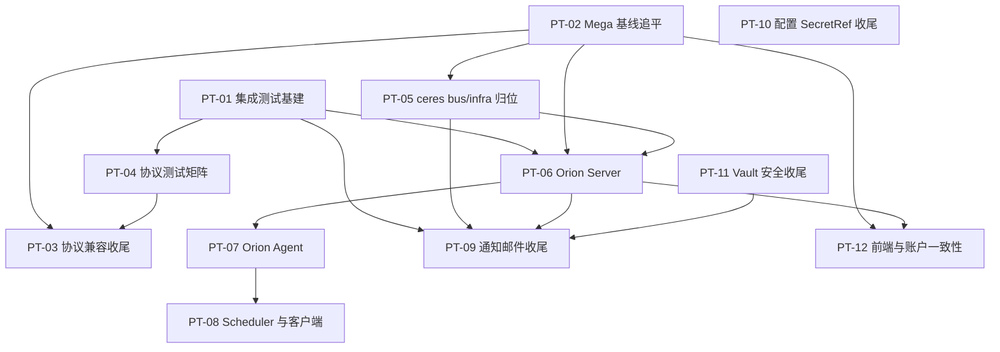

# monoengine 长期移植规划（Mega → monoengine 完全移植）

## 文档职责与维护协议

本文是 monoengine 不绑定具体发布日期和版本号的长期移植路线图，目标是**把 Mega 项目（`/media/eli/sky/mega`）的 Rust 后端能力完整移植到 monoengine**，并在移植过程中保留 monoengine 已确立的架构改进。同时，本文承载前端一致性约束：Mega 目标项目的前端与账户系统由 moon + campsite（`/media/eli/sky/campsite`）承载，monoengine 的前端与账户系统是 monoui 仓库（`gitmono-dev/monoui`，sibling `../monoui`）`monoengine` 分支的 `apps/next-app`；两个前端体系的功能必须保持一致（见规划原则 11 与 PT-12）。它回答"哪些 Mega 能力尚未移植、为什么、依赖什么、何时具备进入日期计划的条件"，不是 release 承诺、owner 清单或逐项实施任务表。具体设计、迁移、拆分、发布和回滚只进入按日期计划（`plan-YYYYMMDD.md`）或后续 RFC/ADR。

> **术语（2026-08-21）**：本文其余处出现的 *website* 是**角色名**（monoengine 的
> 前端 / 认证与产品邮件投递面），不再是仓库名——其实现仓库自 2026-08-21 起为
> `gitmono-dev/monoui` 的 `monoengine` 分支。派生标识（契约名 `website-mail`、
> Compose 服务 `website-next` / `website-db-init`、隔离账户库 `website`、配置键
> `MEGA_OAUTH__WEBSITE_*` / `MEGA_NOTIFICATION__WEBSITE_MAIL_*`、测试门
> `WEBSITE_IT`）**一律不改名**。

本文的持续事实来源有两类：

- **Mega 目标项目源码**（移植来源与契约基线，不是竞品或外部参照）：以 pinned revision 的 checkout 为准，逐 crate 审计移植状态；浮动 `main` 不作为规范。
- **monoengine 当前 checkout**：已完成移植的事实以当前代码、测试和 `docs/refactoring/` 重构文档为准，历史计划或对 Mega 目标项目的历史描述只作为线索。

状态定义如下：

| 状态 | 含义 |
|---|---|
| 候选 | 有移植线索，但 monoengine 缺口、架构适配或证据尚不足 |
| 已验证 | 已同时核对 Mega 目标项目源码与 monoengine 当前源码/测试，确认缺口真实存在 |
| 已排期 | 已有按日期计划覆盖该 PT 的明确范围，并从本文链接 |
| 实施中 | 该 PT 已有已合入切片，长期完成判据仍未全部满足 |
| 已实现 | 当前可发布版本中的代码、测试、用户/兼容文档共同证明完成判据已满足 |
| 已替代 | 原移植需求仍有效，但由另一 PT 或更合适的机制承接 |
| 不采纳 | 经审计确认不适合 monoengine（或明确属于范围外资产），保留编号与理由 |

只有当前 checkout 的代码、测试、兼容性与用户文档，以及可发布版本证据共同成立时，PT 才能标记"已实现"。日期计划写完、Mega 目标项目已有该能力、存在 schema 或文档声明都不构成实现证明。PT 编号一经引用不重编号；详细章节不承担排序，唯一排序入口是"长期功能总览"。

## 本次 Mega 源码审计快照

审计时间：**2026-08-11**。审计方式：分别核对两个仓库的当前 checkout 与工作区状态。（**2026-08-27 订正**：本行原写「使用 libra……两仓库均由 libra 管理，不得用 git 命令误判」；monoengine 已于当日删除 `.libra` 改由 Git 管理，本仓一律用 `git` 命令核对。Mega 目标项目侧的 VCS 归属未随之变化，下次审计时须逐仓确认后再选命令，不得沿用「两仓库同构」的旧假设。上述 2026-08-11 的审计结论本身不受影响，不回改。）

- Mega 目标项目：`main` @ `3d22823e8533dd2bb7a275a92e18d8f0160f9929`（2026-08-11，`fix(identity): treat CLA as signed across username/github/public-id aliases (#2169)`）；其前一提交为 `#2168`，用于无 SQL 修复过渡期 CL reviewer。
- monoengine：`main` @ `38feb4dd78edc998570df17ae9906af56a801d9e`，版本 v0.2.15。最近一次完整 Mega 同步分析仍基于 `#2129`；截至本次审计，**`#2130..#2169` 尚未逐提交归类，漂移窗口扩大。**
- monoengine 工作区：除本文件外还存在用户或并行工作改动，覆盖 Git protocol、配置、测试与相关文档；本次只更新 `plan-long.md`，不将这些改动作为本次路线图结论或修改其文件。
- 关联前端与账户系统（PT-12 事实基线，2026-08-21 核对）：campsite（`/media/eli/sky/campsite`，Rails 应用，Mega 前端 moon 的账户/后端配对，Mega 侧引用不在本次改指范围）；**前端仓库自 2026-08-21 由 `genedna/website` 改指 `gitmono-dev/monoui`**（sibling `../monoui`，libra 管理），当前 checkout 为 `monoengine` 分支且工作树 clean。执行 PT-12 对照或联动发布前，仍须记录该分支的 pinned revision（唯一事实源：[`../refactoring/website-auth.md`](../refactoring/website-auth.md) §头部）；其 `apps/next-app`（Next.js）仍是 monoengine 的前端与账户系统。

Mega workspace crate 审计表（15 个 Rust crate + 前端与非 Rust 资产）：

| Mega 资产 | 职责 | 移植状态 | monoengine 对应 | 证据入口 |
|---|---|---|---|---|
| `mono` | 主二进制：CLI、service(http/ssh/multi)、HTTP API 全套路由、bootstrap、server、git_protocol、email、notification、orion_build_dispatch | 已移植（高度重构；本仓 SMTP/`src/mail` 已按 ADR-WA-08 退场，产品邮件投递归属 website） | `src/cli.rs` + `bin/`、`src/commands/`、`src/server/`、`src/api/`、`src/context/`、`src/contract/git_protocol/`、`src/notification/`、`src/bellatrix/` | 各 crate `src/` 顶层结构对照；邮件契约见 `docs/refactoring/website-mail.md` |
| `ceres` | monorepo 领域库：application、bus、diff、infra、lfs、merge_checker、model、transport | 部分移植 | `src/ceres/`（api_service/build_trigger/code_edit/diff/lfs/merge_checker/model/pack/protocol）；application/artifact→`src/jupiter/service/artifact_service.rs`、application/buck→`buck_service.rs`、application/webhook→`webhook_service.rs`、application/notification→`src/notification/` | **`ceres/bus`、`ceres/infra` 未作为模块移植（PT-05）；Mega #2138/#2139 已把二者纳入 application/transport 分层，必须按新路径审计，不得按旧目录直接复制** |
| `jupiter` | 存储层：model、redis、service、storage、tests、utils | 已移植 | `src/jupiter/` | 同名目录结构 |
| `jupiter/callisto` | sea-orm 实体 | 已移植 | `src/callisto/` | 同名目录结构 |
| `jupiter-migrate` | sea-orm 迁移 | 已移植 | `src/jupiter/migration/` | 同名目录结构 |
| `common` | config、enums、errors、utils | 已移植（config 大幅扩展） | `src/common/`；`common/config` 提升为一级 `src/config/` | `docs/refactoring/config.md` |
| `saturn` | Cedar 策略/授权 | 已移植 | `src/contract/policy/`（并吸入 mono 的 `api/guard/`） | `docs/refactoring/contract.md` |
| `vault` | RustyVault 集成 | 已移植 + 已加固：形态为 crates.io `libvault` 0.3.0 + 集成层（vendored `src/vault/` 于 2026-08-21 删除，见 [`plan-20260820.md`](plan-20260820.md)） | `libvault` crate + `src/contract/vault/` | `docs/refactoring/vault.md`；ADR-VLT-01 |
| `api-model` | API DTO | 已移植 | `src/contract/api/` | `docs/refactoring/contract.md` |
| `io-orbit` | 对象存储 | 已内联 | `src/orbit_api/` + `src/orbit/`，经 `build_object_storage` 直连工厂 | `docs/refactoring/orbit.md` |
| `clients/orion-client` | orion-server HTTP 客户端 | 部分移植 | `src/bellatrix/`（仅 build dispatch 路径） | 完整 API 面未核对（PT-08） |
| `clients/orion-scheduler-client` | orion-scheduler HTTP 客户端 | **未移植** | 无 | PT-08；Mega #2143/#2146/#2150/#2159/#2160 已扩展 runner provisioning、multi-VM、磁盘状态和 VM 元数据面 |
| `orion` | 构建执行 agent（antares、buck_controller、disk、repo、ws、api） | **未移植** | 无 | PT-07 |
| `orion-server` | 构建任务服务端（api、buck2、log、model、repository、scheduler、service、server） | **未移植** | 无（仅保留消费侧 `buck_router`/`artifacts_router`/`build_trigger_router` API 面） | PT-06；Mega #2163 新增无 idle worker 时最长 60 分钟的构建排队语义 |
| `orion-scheduler` | QEMU VM 弹性调度（vm_manager、vm_cleanup、keep_alive、orion_deployer、webhook） | **未移植** | 无 | PT-08 |
| `moon` | Web 前端（pnpm + turbo，Next.js） | 范围外 | 无（引擎只移植 Rust 后端） | 见"不进入本长期移植计划的 Mega 资产" |
| `tests/` | Git 协议/对象层集成测试夹具（data、diff、objects、refs、scripts） | **未移植** | monoengine 有 `test/project/` 与 `bin/tests/`，协议级夹具未系统移植 | PT-04 |
| `scripts/`、`docker/` | 运维/部署辅助（crates-sync、init_mega、demo、deployment） | 未移植 | 无 | 是否移植需单独决策，见"不进入"章节 |

最近审计记录最多保留 12 次；超过上限后把更早记录压缩为 revision 集合与结论，不保留逐 crate 对照日志。

| 审计日期 | Mega revision | monoengine 基线 | 路线图结论 |
|---|---|---|---|
| 2026-08-26 | `2398a92`（含 #2175） | v0.3.5（`91df97c`） | [`plan-20260826.md`](plan-20260826.md) 收口窗口 #2130→#2175：LFS lock list limit 校验与 400 分类（#2175）、import attach `.gitkeep` blob 持久化（#2152）、CL 列表 build_status worst-wins 聚合与回填（#2163 附带项）已交付（SYNC-01..05）；campsite 身份模型（#2165–#2170）、ceres application/transport/bus 结构重构（#2138/#2139/#2142）、locks/verify 400 分类登记为 DEFER-SYNC-02/03/05，不改变 PT 状态。 |
| 2026-08-11 | `3d22823`（含 #2169） | v0.2.15（`38feb4d`） | 复核确认 PT-01 已完成、PT-04 已进入日期计划；PT-03 已吸收 auth、delete-only、per-channel state 与 capability 收敛，只余 streaming 和完整矩阵。对象存储/Redis SecretRef、Slack/Webhook、Vault file audit sink 已交付，分别从 PT-10/PT-09/PT-11 的缺口移除。Mega #2130..#2169 仍未完成逐提交归类；新增账户审批/Cedar 管理、Orion queue/runner/VM 表面扩大 PT-02/PT-06/PT-08/PT-12 的审计范围；#2165..#2169 的 identity/Cedar reviewer 域（Cedar reviewer 解析、campsite_user_id、admin 检查、CLA 签名）进一步扩大 PT-02/PT-12 的对照范围。 |
| 2026-08-03 | `42cd288d`（含 #2163） | v0.2.1（`39f74332`） | 复核确认 PT-01 已完成、PT-04 已进入日期计划；PT-03 已吸收 auth、delete-only、per-channel state 与 capability 收敛，只余 streaming 和完整矩阵。对象存储/Redis SecretRef、Slack/Webhook、Vault file audit sink 已交付，分别从 PT-10/PT-09/PT-11 的缺口移除。Mega #2130..#2163 仍未完成逐提交归类；新增账户审批/Cedar 管理、Orion queue/runner/VM 表面扩大 PT-02/PT-06/PT-08/PT-12 的审计范围。 |
| 2026-07-27 | `d2b6d1c3`（#2157） | v0.1.50（`562122c2`，同步分析基于 #2129） | 首版：确认 orion 三件套、ceres/bus+infra、协议测试夹具为主要缺口；已移植模块存在 #2129→#2157 漂移窗口；集成测试基建（PT-01）排为下一个执行任务，Mega 基线追平（PT-02）紧随其后 |

**本次结论：PT-01（集成测试基建扩展与统一）已完成；PT-04 已由 `plan-20260803.md` 承接。orion 三件套仍是最大整体缺口，且上游的 queue、runner provisioning、multi-VM 与磁盘压力语义已扩大其移植基线。新增的 #2165..#2169 属 identity/Cedar reviewer 域，不改变任何 PT 状态或优先级，但扩大 PT-02（逐提交归类）与 PT-12（双前端账户/认证语义对照）的审计范围。**

## 规划原则

以下原则适用于 PT-01 至 PT-12：

1. **忠实移植优先于重新设计。** 默认保留 Mega 的 wire 行为、DB schema、API 契约和错误语义；架构性偏离必须是已决 ADR 并记录在案（如 contract 归并、config 提升、workspace 拆分），不得在执行中临时发明。
2. **monoengine 的架构改进不回退。** 单 package `monoengine`（lib `monoengine_core` + `[[bin]]`）、`src/contract/` 边界归并、一级 `src/config/`、`src/notification/`（邮件投递已迁 website，见 ADR-WA-08）、Vault（crates.io `libvault` + `src/contract/vault/` 集成层加固；不得回流为内嵌 vendored fork，亦不得因与 Mega `libvault-core` 目录差异而回退——依赖形态演进见 [`plan-20260820.md`](plan-20260820.md) ADR-VLT-01）、orbit 内联于 `src/orbit_api/` + `src/orbit/`（见 [`plan-20260824.md`](plan-20260824.md)）、对象存储构造时机等已交付改进，不因"与 Mega 不一致"而改回。
3. **移植前必须 pin 并核对 Mega revision。** 每个日期计划开工前用 libra 记录 Mega 实际 checkout revision，逐文件刷新源码锚点；不得把浮动 `main`、历史同步报告或本文快照当作当前事实。
4. **先追平、后扩展。** 已移植模块的 Mega 基线漂移（PT-02）优先于在其上叠加新能力；在漂移窗口上实施新 PT 前，必须先确认相关模块的 Mega 变更已被吸收或明确排除。
5. **三门验收是硬门禁。** 每个任务至少通过 `cargo +nightly fmt --all --check`、`cargo clippy --all-targets --all-features -- -D warnings`、`source .env.test && cargo test ...` 指定用例；`cargo build [--tests]` 保持 0 错误 0 警告。
6. **机器接口与文档同步。** 涉及公开命令、配置项、DB schema、HTTP API、错误码或存储格式的移植，必须同步 OpenAPI schema、配置示例、错误码文档和测试，并遵守 `AGENTS.md` 的实体/迁移/子命令登记流程。
7. **安全边界 fail-closed。** Vault、SecretRef、认证授权、协议输入解析的安全语义不得因移植而弱化；Mega 目标项目的宽松默认不自动成为 monoengine 的默认。
8. **不重复建设事实源。** Mega 侧能力若已被 monoengine 以更强形态覆盖（如 notification、config、mail），不回流旧实现；只补缺口，不重复移植。
9. **测试随代码移植。** 移植功能必须携带或重建其测试；禁止手写 schema SQL，必须走真实 migration；集成测试沿用 docker-compose 测试栈与 `bin/tests/` 黑盒分层。
10. **计划状态必须据代码更新。** 每次审计重新读取当前 `src/`、migration、API 路由和相关测试；不得复制上次"当前基础"文字代替复核。
11. **双前端一致性。** Mega 前端体系是 moon + campsite，monoengine 前端与账户系统是 monoui `monoengine` 分支的 `apps/next-app`；monoengine 的公开 API 与账户行为必须与 `apps/next-app` 对齐，且两个前端体系的功能保持一致。任何新增或变更后端公开行为的 PT/日期计划，必须包含对两侧前端的影响评估；不允许单侧漂移（详见 PT-12）。

## 当前基础

以下事实已在 2026-07-27 以当前 monoengine checkout（v0.1.50，`562122c2`）的源码、测试与 `docs/refactoring/` 文档复核；历史计划不作为实现证据：

| 基础能力 | 当前事实 | 长期规划中的用途 |
|---|---|---|
| callisto 实体 + jupiter storage/migration/redis | 已从 Mega 移植并持续对齐（最后同步基于 Mega #2129） | 所有 PT 的数据层基础 |
| `src/config/` 一级配置体系 | LoadMode、SecretRef/resolver、`config` 命令族、集中校验、Profile、测试分层、受控热加载已交付；对象存储与 Redis 凭据均已支持 post-vault `SecretRef`（`docs/refactoring/config.md`、`vault.md`） | PT-10 的起点；所有服务的配置承载 |
| `src/contract/` 边界归并 | api/git_protocol/policy/vault 四域归并完成，旧路径无兼容层（`docs/refactoring/contract.md`） | 新移植模块的落点规范 |
| Vault（crates.io `libvault` 0.3.0 crate + 集成层） | A–J 阶段可交付子集完成：fail-closed、DB-only bootstrap、root token 退役、unseal share rekey、backup/restore、可配置 file audit sink 和 fail-closed 审计策略（`docs/refactoring/vault.md`）；依赖形态已由 vendored 迁回 crates.io `libvault`，UN-31 只读引导在集成层重建（[`plan-20260820.md`](plan-20260820.md)） | PT-11 的起点；凭据类 PT 的前置 |
| `src/notification/`（邮件投递在 website） | in-app / Slack / generic webhook 编排已交付，渠道凭据经 SecretRef；本仓 SMTP/`[mail]`/`email_jobs` 已移除，产品邮件经 website 内部 API（ADR-WA-08；`docs/refactoring/website-mail.md`） | PT-09 的起点 |
| orbit 对象存储（内联） | `src/orbit_api/` + `src/orbit/` 单 package；`object_store` cloud features 在 core 编译图 | LFS/artifact/构建产物的存储承载 |
| Git smart HTTP/SSH 协议 | `info/refs` 严格化、fallible pkt-line parser、SSH exec parser、per-channel state、认证上下文、delete-only receive-pack、capability truth table、HTTP LFS 边界与首批真实 CLI smoke 已交付；HTTP/SSH 仍完整缓冲请求/通道（`docs/refactoring/protocol.md`） | PT-03/PT-04 的起点 |
| bellatrix（orion-client 部分移植） | build dispatch 路径可用，替代 Mega mono 的 `orion_build_dispatch.rs` | PT-06/PT-07/PT-08 的客户端侧基础 |
| 集成测试基建 | docker-compose 测试栈（Postgres/Redis/Mailpit/RustFS/git-cli/`website-next`，`-p monoengine-it`）、`integration_vault` / `integration_git_cli` / `integration_website_auth` 黑盒；mailpit **消费方 = website IT**（非本仓 SMTP）；CI `config-validation.yml` 与 `git-protocol-smoke.yml` | 全部 PT 的验收承载；PT-01 收口最小矩阵；PT-04 的 SSH/LFS 与完整协议矩阵已进入 `plan-20260803.md` |

## 长期功能总览

| ID | 能力 | 优先级 | 状态 | 当前判断 | Mega 证据（revision `3d22823`） | 已关联日期计划 | 最近验证 |
|---|---|---:|---|---|---|---|---|
| PT-01 | 集成测试基建扩展与统一 | P0 | **已完成**（D 组绿于 v0.1.177，2026-07-30） | git-cli runner、HTTP 最小矩阵、热加载/多渠道扇出黑盒、并发 dispatcher 基线与 CI 执行/触发面已落地；P2：`config init`/热加载/多渠道扇出已落地，次渠道 retry（`DEFER-IT-10`）、GCS（`DEFER-IT-08`）、全局 disabled vs `system_required`（`DEFER-IT-07`）书面关闭；SSH/LFS 完整矩阵与真多进程黑盒仍属 PT-04/PT-09 | `mega/tests/`（对照）、`docs/refactoring/integration.md` P2 清单 | [`plan-20260727.md`](plan-20260727.md)（IT-01、IT-02、IT-03、IT-04、IT-06、IT-07、IT-08、IT-09、IT-10、IT-11、IT-12；IT-05 已关闭为非任务卡） | 2026-07-30 |
| PT-02 | 已移植模块 Mega 基线追平与持续同步 | P0 | 已验证 | monoengine 同步基线停在 Mega #2129，Mega 已到 #2169；callisto/jupiter/ceres/mono 对应面需逐模块核对漂移，重点包括 #2138/#2139 分层重构、#2145 账户审批、#2147 Cedar 管理、#2152 对象缺失处理，以及 #2165..#2169 的 identity/Cedar reviewer 域 | Mega log #2130–#2169 | 无 | 2026-08-11 |
| PT-03 | Git 协议兼容性与 LFS 收尾 | P0 | 部分完成 | auth 上下文、delete-only push、SSH per-channel state、capability truth table、LFS 路径/认证边界已交付；**repo/path 级 push ACL / Cedar 三态 push 门**已由 [`plan-20260812.md`](plan-20260812.md)（REL-01 UN-02/UN-03/UN-13）交付；仍缺 streaming pkt-line 与完整 CLI 故障/并发矩阵 | `mega/mono/src/git_protocol/`、`mega/ceres/src/transport/` | 无 | 2026-08-03 |
| PT-04 | Git 协议集成测试夹具与真实 CLI 兼容矩阵 | P0 | 实施中 | `plan-20260803.md` 已交付 HTTP `pull`、`anonymous_access=false` 真实客户端拒绝、HTTP LFS 往返、cargo-native SSH clone/pull/push 与坏密钥拒绝矩阵并接入 CI；Mega 夹具审计结论 NO-GO（`DEFER-GM-03`，`docs/refactoring/mega-git-fixtures-audit.md`）；剩余 `DEFER-GM-01/02/04/05`（ImportRepo 矩阵、pure SSH LFS、shell SSH 广度 CI、missing-repo 探针）为 follow-up | `mega/tests/{data,diff,objects,refs,scripts}` | [plan-20260803.md](plan-20260803.md)（GM-* / GM-R1） | 2026-08-12 |
| PT-05 | ceres/bus 事件总线与 infra 基础设施归位 | P1 | 已验证 | `TransportRuntime`/`TransportEvent`/`ApplicationEventHandler` 未移植；cache 已并入 api_service，pack_decode/pack_stream 逻辑散落 | `mega/ceres/src/bus/`、`mega/ceres/src/infra/` | 无 | 2026-07-27 |
| PT-06 | Orion Server 构建控制面移植 | P1 | 已验证 | 整体缺失；monoengine 仅保留消费侧 API 面（buck/artifacts/build_trigger router）与 bellatrix 客户端 | `mega/orion-server/`、`mega/mono/src/api` 的 orion_runner_router | 无 | 2026-07-27 |
| PT-07 | Orion 构建执行 Agent 移植 | P1 | 已验证 | runner（ws 客户端、buck_controller、disk/repo 管理）整体缺失 | `mega/orion/` | 无 | 2026-07-27 |
| PT-08 | Orion Scheduler、VM 弹性调度与客户端 API 面补齐 | P2 | 已验证 | scheduler 与 orion-scheduler-client 未移植；bellatrix 仅覆盖 build dispatch，完整 OrionBuildClient API 面未核对 | `mega/orion-scheduler/`、`mega/clients/` | 无 | 2026-07-27 |
| PT-09 | 通知与邮件能力对齐收尾 | P2 | 实施中 | **本仓邮件投递已移除**；**website 内部产品邮件 API、Slack 与 generic webhook 均已落地**，渠道凭据经 SecretRef；compose `mailpit` 消费方 = website IT。剩余：build 完成触发器、次渠道 retry（`DEFER-IT-10`）、真实多进程/多实例黑盒矩阵 | `mega/mono/src/notification/`、campsite slack 参考 | [`plan-20260731.md`](plan-20260731.md)（MN-01..MN-06）；[`plan-20260802.md`](plan-20260802.md)（WE-* / DEP-06） | 2026-08-03 |
| PT-10 | 配置体系与 SecretRef 收尾 | P2 | 实施中 | 对象存储与 Redis SecretRef、`[oauth]`、跨 source/profile diagnostics 和首批热加载黑盒均已落地；剩余为真实消费者订阅清单、跨 await 生命周期审计与持续扩展，而非启动顺序改造 | `mega/common/src/config`（基线对照） | [`plan-20260731.md`](plan-20260731.md)（AU-02；`[oauth]`） | 2026-08-03 |
| PT-11 | Vault 安全工程收尾 | P2 | 实施中 | file 持久化 audit sink、可选 fail-closed、backup/restore、unseal share rekey 已交付；仍缺 KEK 轮换（无 RustyVault 原语）、异地/HTTP audit sink、外部托管 root recovery 与格式版本策略；**依赖形态**（vendored → crates.io `libvault` 0.3.0 + UN-31 只读模式集成层重建）已由 [`plan-20260820.md`](plan-20260820.md) 于 2026-08-21 交付，本 PT 安全收尾缺口不变 | `mega/vault/`（基线对照） | [`plan-20260820.md`](plan-20260820.md)（依赖形态；非 KEK/审计 sink） | 2026-08-21 |
| PT-12 | 前端与账户系统一致性（website `apps/next-app` ↔ Mega moon+campsite） | P1 | 候选 | **会话信任路径与 compose 同栈 IT**（website-next + `integration_website_auth`）已实现；**身份键迁移**已由 [`plan-20260812.md`](plan-20260812.md) UN-05 handoff 移交本 PT（DEP-04 outgoing，实际移交 **2026-08-17**；DEFER-UN-04 八项承接约束）；Mega #2145 账户审批、#2147 Cedar 管理及 #2165..#2169 的 identity/Cedar reviewer 域扩大全量 moon↔`apps/next-app` 对照范围；monoui `monoengine` 分支 pin 须执行期确认；全量对照仍候选 | monoui `apps/next-app`、`mega/moon/`、campsite | [`plan-20260731.md`](plan-20260731.md)（AU/ITW）；handoff [`plan-20260812.md`](plan-20260812.md) UN-05/DEP-04 | 2026-08-17 |

## 工程安全基线

以下项目不新增 PT 编号，而是全部移植与收尾工作进入实施和发布前必须持续满足的工程门禁。完成状态必须由代码、回归测试和故障注入证明，不能仅以文档或人工约定关闭。

| ID | 修复主题 | 优先级 | 当前判断 | 阻断范围 |
|---|---|---:|---|---|
| SB-01 | 消除生产路径残余 panic/unwrap | P1 | 协议 response builder、`repo.rs` 路径转换、config 残余加载路径等仍有未收敛点 | 协议、API、配置加载、全部服务可靠性 |
| SB-02 | 凭据与 secret 边界持续收敛 | P1 | 本仓 `mail.password`/SMTP 已随 ADR-WA-08 移除；剩余 redaction 覆盖面、resolver 缓存失效语义、website-mail bearer / 对象存储 SecretRef 收敛 | vault、对象存储、通知渠道（website-mail client） |
| SB-03 | 测试门禁、Docker 测试栈与 CI 可信度 | P1/P2 | 三道门禁与 docker-compose 栈运行良好；PT-01 最小真实 Git CLI + 双实例 dispatcher 基线已落地；SSH/LFS 完整矩阵与真多进程黑盒仍缺 | CI 稳定性、回归可信度与全部 PT 的验收承载 |

### SB-01：消除生产路径残余 panic/unwrap

#### 当前风险

- `src/contract/git_protocol/` 与 `src/ceres/protocol/` 的 response builder、in-memory reader、`repo.rs` 路径转换等仍有 `docs/refactoring/protocol.md` 记录的残余 `unwrap()`。
- 配置加载路径上仍有 `docs/refactoring/config.md` 记录的残余 `expect`/`panic` 待继续收敛。
- 移植新模块时若直接复制 Mega 目标项目的 `unwrap()`/`expect()`/`panic!()`，会扩大风险面。

#### 修复要求

- 生产代码不得新增未解释的 `unwrap()`、`expect()` 或 `panic!()`；确属不可失败逻辑必须有 `// INVARIANT:` 注释并在任务验收中说明（`docs/plan/plan-template.md` 使用规则）。
- 协议输入一律走 fallible parser；网络字节不得触发 panic、整数下溢或越界切片。
- 移植任务交付前对移植面运行 panic 审查，Mega 侧的 panic 点必须 Result 化后落地。

#### 完成判据

- protocol.md、config.md 记录的残余清单全部关闭或有最小范围豁免与可验证 invariant。
- 故障注入（malformed pkt-line、坏 TOML、损坏 HEAD、失效路径）均产生稳定、可操作的错误而不终止进程。

### SB-02：凭据与 secret 边界持续收敛

#### 当前风险

- 本仓 SMTP / `mail.password` 已移除（ADR-WA-08）；website-mail bearer 与对象存储等凭据的 SecretRef / 脱敏覆盖仍须持续收敛。
- redaction/SecretString 覆盖面（对象存储 key、外部服务 URL、website-mail bearer）未完全扩展。
- 凭据变更时 resolver 缓存失效语义（`evict`/`evict_all` 的调用点）未逐点确认。

#### 修复要求

- 新移植的凭据消费端一律先落 SecretRef，不新增明文凭据配置项；禁止在本仓回退 SMTP/`[mail]`。
- 错误与日志路径的脱敏测试随功能同步交付（沿用 `integration_error_redaction` 模式）。
- 引导循环硬约束继续成立：数据库凭据永远不能是 vault SecretRef；对象存储/Redis 进 vault 之前必须完成 PT-10 的后置初始化。

#### 完成判据

- 本仓无 SMTP/`mail.password` 配置面；website-mail 与其它 secret 缺失时 fail-closed 且错误不回显值。
- 活进程脱敏门禁覆盖 DB、Redis、对象存储与 website-mail bearer 等现行凭据类。

### SB-03：测试门禁、Docker 测试栈与 CI 可信度

#### 当前风险

- 三道门禁与 docker-compose 测试栈（postgres:15、redis:7、mailpit）运行良好，但真实 Git CLI 兼容矩阵、多进程 outbox claim 竞争矩阵、热加载黑盒用例未建立。
- 移植 orion 三件套将引入 ws、VM、构建产物等新基础设施，测试栈不扩展则验收无承载。

#### 修复要求

- 新增基础设施组件必须先定义测试双层（模块集成 + `bin/tests/` 黑盒）与 docker-compose 拓扑，再落地实现。
- 禁止手写 schema SQL；必须断言连接的是 PostgreSQL；镜像固定 tag；secret 只经 stdin。

#### 完成判据

- PT-04 的真实 CLI 矩阵、PT-09 的多实例矩阵、PT-06/07 的 ws/构建链路基线用例进入 CI 可运行形态（基建承载由 PT-01 交付）。

## PT-01：集成测试基建扩展与统一

### 移植问题

当前集成测试基建（docker-compose 测试栈 postgres:15/redis:7/mailpit、`bin/tests/` 黑盒、模块集成测试、CI `config-validation.yml`）只覆盖 config/vault/mail/notification 链路。后续 PT 将引入真实 Git CLI 协议矩阵、orion ws 服务、多实例 outbox 竞争、热加载黑盒等新形态负载，现有拓扑与 harness 无承载；不先统一基建，每个 PT 会各自发明测试脚手架，重复、不可比且无法进入 CI。

### 目标范围

- 统一测试双层规范（模块集成测试 + `bin/tests/` 黑盒）与 fixture 生命周期管理，新组件按规范接入。
- docker-compose 测试栈拓扑扩展机制：新增服务（Git CLI runner、orion-server、fake webhook receiver 等）有标准登记方式；固定端口、固定镜像 tag、secret 只经 stdin 的纪律不变。
- 交付真实 Git CLI smoke 最小矩阵（HTTP 通道 clone/push），作为拓扑扩展的示范负载。
- 热加载黑盒用例、多实例 outbox claim 竞争基线用例进入 CI 可运行形态。
- `docs/refactoring/integration.md` 的 P2 清单逐项落地或书面关闭。

### 非目标

- 不追求覆盖率数字；本 PT 只为后续 PT 提供验收承载。
- 不重写既有测试；只扩展拓扑与规范。
- Git 协议专项矩阵的完整用例面与 Mega `tests/` 夹具的审计移植属 PT-04。

### 完成判据

- 新服务接入测试栈有标准流程，并以 Git CLI runner 为示范落地。
- HTTP 通道真实 Git CLI 最小矩阵、热加载黑盒、多实例竞争基线用例 CI 绿。
- integration.md P2 清单全部有"落地 / 关闭（含理由）"结论。

### 审计证据、真实缺口与提升条件

- **monoengine 现状证据（已完成，2026-07-30）**：`docker-compose.test.yml`、`bin/tests/integration_vault.rs`、`bin/tests/integration_git_cli.rs`、`.github/workflows/config-validation.yml` / `git-protocol-smoke.yml` 已复核；`docs/refactoring/integration.md` P2 清单为 **扇出/热加载/`config init` 已落地**，缺口书面关闭（`DEFER-IT-07`/`DEFER-IT-08`/`DEFER-IT-10`）；git-cli runner、HTTP 最小矩阵、并发 dispatcher 基线与 CI 执行/触发面已由 `plan-20260727.md` 交付。IT-03 / IT-04 / IT-11 D 组已绿（`validate-config` [30466831819](https://github.com/gitmono-dev/monoengine/actions/runs/30466831819)；`git-protocol-smoke` [30479301244](https://github.com/gitmono-dev/monoengine/actions/runs/30479301244)）。
- **Mega 证据**：`mega/tests/` 协议夹具存在（专项审计移植归 PT-04）；`mega/orion*` 的 ws/构建链路测试形态在 monoengine 无承载（归 PT-06/07）。
- **完成判据对照（`:202-204`）**：① 新服务接入有标准流程且以 Git CLI runner 示范落地 —— 满足（`test-infra.md` + compose `git-cli`）；② HTTP 通道真实 Git CLI 最小矩阵、热加载黑盒、多实例竞争基线用例本地绿、已接入 CI，且远端 CI 绿（IT-03/IT-04/IT-11 D 组）—— 满足；③ integration.md P2 清单全部有「落地 / 书面关闭（含理由与承接编号）」结论 —— 满足（无「延后」）。
- **风险与边界**：测试栈膨胀会拖慢 CI；新服务必须可选启用（`profiles`），本地单元测试路径不受影响。SSH/LFS 完整矩阵与真多进程黑盒仍分别属 PT-04 / PT-09。

### 依赖与顺序

PT-01 不依赖其他 PT，是全部后续 PT 的验收承载：PT-04（协议矩阵）、PT-06/PT-07（orion 链路）、PT-09（多实例矩阵）的验收依赖本 PT 的拓扑扩展。

---

## PT-02：已移植模块 Mega 基线追平与持续同步

### 移植问题

monoengine 的 callisto、jupiter、ceres、mono 对应面最后系统同步基于 Mega `#2129`（v0.1.50 同步分析报告），Mega 已推进到 `#2169`。在漂移窗口上直接实施 PT-03 至 PT-08，会把"移植缺口"与"Mega 新变更"混在一起，导致锚点失效和重复劳动。

### 目标范围

- 用 libra 核对 Mega `#2130..#2169` 的全部提交，按模块分类：callisto 实体、jupiter storage/migration、ceres、mono API/命令、vault、saturn、api-model、clients。
- 对每个已移植模块给出"吸收 / 明确排除（含理由）/ 转 PT-xx 承接"的三选一结论。
- 建立持续同步机制：每次审计记录 Mega revision 与漂移结论，写回本文"审计快照"章节。
- 漂移追平不得引入与 monoengine 架构改进冲突的回流（原则 2、8）。

### 非目标

- 不追赶 Mega 的发布节奏；只追平与已移植模块相关的变更。
- 不在本 PT 内实施 orion 三件套等新模块移植（属 PT-06/07/08）。
- 不处理 moon、scripts、docker 等非 Rust 资产。

### 完成判据

- Mega `#2130..#2169` 每个提交都有书面归类结论；被吸收的变更已合入并通过三门验收。
- callisto 实体与 migration 与 Mega 当前 schema 一致，或差异有书面豁免理由。
- 本文"审计快照"更新到吸收完成时的 Mega revision，并注明下一次核对基线。

### 审计证据、真实缺口与提升条件

- **Mega 证据**：`main` @ `3d22823`（含 #2169）；#2130–#2169 区间内容未在 monoengine 侧归类。优先审计 #2138/#2139 的 ceres application/transport/bus 重构、#2145 账户审批、#2147 Cedar 管理、#2152 缺失对象错误处理，以及 #2143/#2146/#2150/#2160/#2163 的 Orion provisioning、VM、磁盘和排队语义；#2165..#2169 的 identity/Cedar reviewer 域（Cedar reviewer 解析、campsite_user_id、admin 检查、CLA 签名）与 #2145/#2147 同域，一并纳入优先审计。
- **monoengine 现状证据**：v0.1.50 提交说明明确"Read-only analysis of upstream mega (HEAD #2129)"；此后无同步记录。
- **最小可验证第一阶段**：先产出逐提交归类表（纯审计，不改代码），再按模块分批吸收；第一批只处理 callisto/jupiter（数据层漂移风险最高）。
- **风险与边界**：漂移追平期间若发现 Mega 侧重构与 monoengine 架构决策冲突，停下来记 ADR，不做静默折中。

### 依赖与顺序

PT-02 不依赖其他 PT，是 PT-03、PT-05、PT-06 实施前的推荐前置（在漂移窗口上开工的 PT 必须先自行完成相关模块的局部追平）。

---

## PT-03：Git 协议兼容性与 LFS 收尾

### 移植问题

Git smart HTTP/SSH 协议已完成输入 panic 止血、`info/refs` 严格化、fallible pkt-line parser、SSH exec parser、receive-pack 按 flush-pkt 分割、SSH per-channel state、HTTP/SSH 认证上下文、delete-only push、capability truth table 及 LFS 路径/认证边界加固。核心缺口收敛为：协议路径仍缓冲完整 body/channel、repo/path 级 push ACL、并发 receive-pack 与完整真实客户端故障矩阵。

### 目标范围

- streaming pkt-line reader：HTTP/SSH 协议路径不再缓冲完整 body/channel。
- repo/path 级 push ACL 与 Cedar deny 的协议层回归矩阵；认证后不得退化为默认 permit-all 的隐性放行。
- 并发 receive-pack、`git push --delete`、LFS hybrid 与 missing-repo 的真实客户端故障矩阵。
- capability truth table 的持续维护：新 capability 仅在 advertise/parse/act-on/test 四列一致后声明；不重新声明尚未证明原子性的 `atomic`。
- 残余 `unwrap()` 收敛（与 SB-01 联动）。

### 非目标

- 不承诺 protocol v2、`deepen`/shallow clone、partial clone、pure SSH LFS（protocol.md 阶段 6，P3 另行决策）。
- 不为了对齐 Mega 而重新声明未实现且未测试的 capability。

### 完成判据

- capability truth table 无 ⚠️/❌ 项，或每项有书面豁免；大 payload 在受限内存下 streaming 处理。
- SSH publickey 认证后所有协议操作的 commit binding 携带正确身份，有回归测试。
- repo/path push deny、`git push --delete`、LFS hybrid、并发 receive-pack 的故障注入矩阵通过。

### 审计证据、真实缺口与提升条件

- **Mega 证据**：`mega/mono/src/git_protocol/`、`mega/ceres/src/transport/` 为移植基线；monoengine 已在正确性上局部超过 Mega（capability 诚实化），不回退。
- **monoengine 现状证据**：`src/contract/git_protocol/{http,ssh}.rs`、`src/ceres/protocol/smart.rs` 的止血切片已合入；protocol.md 阶段 3–6 未完成。
- **最小可验证第一阶段**：依 `plan-20260803.md` 先补 HTTP pull / anonymous_access=false / LFS / SSH 真实客户端矩阵，再做 streaming 重构（性能与内存）或 ACL 收敛。
- **风险与边界**：streaming 重构改变热路径内存模型，必须带基准与回退方案；依赖 PT-04 的 CLI 矩阵做防回归。

### 依赖与顺序

PT-03 的 streaming/ACL 行为切片应以 PT-04 的真实 CLI 矩阵为验收承载。开工前完成 PT-02 对 git_protocol/ceres 相关提交的局部追平。

---

## PT-04：Git 协议集成测试夹具与真实 CLI 兼容矩阵

### 移植问题

Mega `tests/` 提供协议/对象层集成测试夹具（`data/`、`diff/`、`objects/`、`refs/`、`scripts/`），monoengine 尚未系统移植；`test/project/` 与 `bin/tests/` 不覆盖该层。HTTP 最小真实 CLI 矩阵已存在，但 HTTP pull、匿名读关闭、HTTP LFS、cargo-native SSH、夹具许可/生成方式和 CI 归属尚待补齐，PT-03 后续改动仍缺完整防回归网。

### 目标范围

- 审计 Mega `tests/` 夹具的内容、许可与生成方式，决定移植、重建或替代。
- 建立真实 Git CLI smoke 矩阵：HTTP/SSH/LFS 三通道的 clone/fetch/pull/push/delete 与关键拒绝用例（protocol.md 已列出建议清单）。
- 矩阵进入 CI 可运行形态（沿用 docker-compose 测试栈纪律：固定端口、固定 tag、无手写 schema）。

### 非目标

- 不追求 Git 官方测试套件级覆盖率（属另一量级的兼容治理）。
- 不把夹具数据直接复制进仓库而不核对其许可与体积。

### 完成判据

- 真实 Git CLI 对 monoengine 服务完成 HTTP/SSH/LFS 三通道正路径与关键故障路径用例，CI 绿。
- 夹具或重建数据有来源记录；新增协议能力必须同步矩阵用例（门禁化）。

### 审计证据、真实缺口与提升条件

- **Mega 证据**：`mega/tests/{data,diff,objects,refs,scripts}` 存在且被 Mega 测试使用。
- **monoengine 现状证据**：`test/project/` 为业务集成测试夹具；`bin/tests/` 已含 `integration_git_cli`（HTTP 最小矩阵 + 字面 `pull` + 匿名读关闭拒绝）、`integration_git_lfs`（HTTP LFS 往返）、`integration_git_ssh`（cargo-native SSH clone/pull/push 与坏密钥拒绝），三 target 已进入 `config-validation.yml` 与 `git-protocol-smoke.yml` 执行面；Mega 夹具审计 NO-GO 落盘于 `docs/refactoring/mega-git-fixtures-audit.md`（`DEFER-GM-03`）。
- **最小可验证第一阶段**：已由 `plan-20260803.md` 交付（HTTP `pull`、`anonymous_access=false` 拒绝、HTTP LFS、cargo-native SSH 与 Mega fixture go/no-go）；「三通道正路径与关键故障路径 CI 绿」已满足，夹具经审计记录来源/许可后决策 NO-GO（`DEFER-GM-03`）；长期完成判据未全部关闭（`DEFER-GM-01/02/04/05` follow-up），本 PT 维持实施中。
- **风险与边界**：SSH 测试固定为 cargo-native self-start，不新增 compose sshd；LFS 依赖对象存储后端，优先 local FS 后端。

### 依赖与顺序

PT-04 紧随 PT-01 启动（拓扑与最小矩阵承载来自 PT-01），其完整矩阵是 PT-03 后续切片的验收承载；与 PT-02 无冲突，可并行。

---

## PT-05：ceres/bus 事件总线与 infra 基础设施归位

### 移植问题

Mega `ceres/src/bus/`（`TransportRuntime`、`TransportEvent`、`ApplicationEventHandler`）与 `ceres/src/infra/`（cache、pack_decode、pack_stream）未作为模块移植。cache 已并入 `src/ceres/api_service/cache.rs`，pack 相关逻辑散落在 `src/ceres/pack/` 与 `src/ceres/protocol/smart.rs`。orion 构建链路（PT-06/07）与 build 完成触发器（PT-09）在 Mega 中均经过事件总线通信，缺失总线会迫使后续 PT 发明临时通道。

### 目标范围

- 审计 `ceres/bus` 在 Mega 中的全部生产者/消费者，判定 monoengine 需要的事件面（构建触发、构建完成、传输事件）。
- 决定归位形态：按 `src/contract/` 边界规范落入合适模块，或论证后明确不移植（状态转"不采纳"并记录理由）。
- `infra` 的 pack_decode/pack_stream 逻辑归位：消除散落重复，落点符合现有 ceres 模块划分。

### 非目标

- 不引入 Mega 未使用的通用事件框架；只移植有真实消费者的事件面。
- 不在本 PT 内接入 orion（消费者接入属 PT-06/07/09）。

### 完成判据

- 事件总线归位（或书面不采纳结论）合入；生产者/消费者清单与 Mega 侧一一对应或有豁免。
- pack_decode/pack_stream 无散落重复实现；三门验收通过。

### 审计证据、真实缺口与提升条件

- **Mega 证据**：`mega/ceres/src/bus/`、`mega/ceres/src/infra/` 目录与引用图。
- **monoengine 现状证据**：`src/ceres/` 模块清单无 bus/infra；`build_trigger` 已存在但事件通道缺失。
- **最小可验证第一阶段**：纯审计——画出 Mega 侧事件生产者/消费者图，给出归位 ADR；代码落地放第二阶段。
- **风险与边界**：事件总线是 PT-06 通信形态的前置决策，拖延会阻塞构建链路设计。

### 依赖与顺序

PT-05 的审计结论（采用 bus 与否）是 PT-06 的前置；开工前完成 PT-02 对 ceres 相关提交的局部追平。

---

## PT-06：Orion Server 构建控制面移植

### 移植问题

Mega `orion-server`（api、buck2、log、model、repository、scheduler、service、server）是构建任务控制面：接收 TaskBuildRequest、调度任务、收集日志、管理产物。monoengine 只有消费侧——`buck_router`/`artifacts_router`/`build_trigger_router` API 面与 bellatrix 客户端——构建任务无处投递。这是"mega 完全移植"最大的整体缺口之一。

### 目标范围

- 移植 orion-server 的 HTTP API、任务模型、调度、日志收集与产物管理，落点遵循 `src/contract/` 与 jupiter 分层规范。
- 移植 mono 侧 `orion_runner_router`（runner 上报/注册接口），补齐 `src/api/router/` 缺失面。
- 实体/迁移按 `AGENTS.md` 流程进入 `src/callisto/` 与 `src/jupiter/migration/`；DB schema 与 Mega 对齐或书面豁免。
- 与 bellatrix（客户端侧）完成端到端联通：dispatch → server 接收 → 状态可查。

### 非目标

- 不移植 runner 执行逻辑（PT-07）与 VM 调度（PT-08）。
- 不改变 monoengine 既有 buck/artifacts API 的公开契约（除非书面 ADR）。

### 完成判据

- bellatrix dispatch 的构建任务在 orion-server 侧可接收、可调度、可查询状态与日志。
- docker-compose 测试栈扩展出 orion-server 拓扑（拓扑机制来自 PT-01），`bin/tests/` 黑盒用例覆盖 dispatch→接收正路径。
- OpenAPI schema、错误码文档、迁移同步；三门验收通过。

### 审计证据、真实缺口与提升条件

- **Mega 证据**：`mega/orion-server/` 完整 crate；`mega/mono/src/api` 的 orion_runner_router；`mega/clients/orion-client` 的完整 API 面。
- **monoengine 现状证据**：`src/bellatrix/` 仅 build dispatch 路径；API state 无 orion-server 相关字段；`src/api/router/` 无 orion_runner_router。
- **最小可验证第一阶段**：任务模型 + 接收 API + 内存/DB 调度最小环，bellatrix 正路径联通；日志与产物管理第二阶段。
- **风险与边界**：通信形态（直发 HTTP vs 事件总线）必须先等 PT-05 结论；schema 对齐需 PT-02 先行。

### 依赖与顺序

依赖 PT-05（通信形态决策）与 PT-02（ceres/callisto 追平）；验收拓扑依赖 PT-01；是 PT-07 的前置。

---

## PT-07：Orion 构建执行 Agent 移植

### 移植问题

Mega `orion` 是跑在构建机上的执行 agent：经 ws 与 orion-server 通信，执行 buck2 构建（`buck_controller`）、管理磁盘与 repo 缓存。monoengine 完全缺失 runner 侧，构建链路即使有 server 也无法执行。

### 目标范围

- 移植 orion agent 的 ws 客户端、任务接收、 buck_controller、disk/repo 缓存管理。
- 与 PT-06 的 server 完成 ws 协议联通：注册、接任务、上报状态与日志。
- runner 侧配置进入 `src/config/` 体系（LoadMode、校验、脱敏纪律不变）。

### 非目标

- 不移植 QEMU/VM 弹性承载（PT-08）；runner 先以常驻进程形态交付。
- 不实现 Mega 也没有的新调度策略。

### 完成判据

- 端到端：bellatrix dispatch → orion-server → orion agent 执行（可用 fake/stub buck2）→ 状态与日志回传可查。
- ws 断连重连、任务抢占、磁盘水位等故障注入用例通过；三门验收通过。

### 审计证据、真实缺口与提升条件

- **Mega 证据**：`mega/orion/src/{ws,buck_controller,disk,repo,api}`。
- **monoengine 现状证据**：无任何 runner 对应物。
- **最小可验证第一阶段**：ws 注册 + 接收任务 + stub 执行 + 状态回传，buck_controller 第二阶段接入真实 buck2。
- **风险与边界**：buck2 依赖与构建机环境差异大，stub 先行可避免环境阻塞；ws 协议契约以 PT-06 落地为准。

### 依赖与顺序

依赖 PT-06（server 与 ws 契约）；是 PT-08 的前置。

---

## PT-08：Orion Scheduler、VM 弹性调度与客户端 API 面补齐

### 移植问题

Mega `orion-scheduler`（QEMU VM 池、webhook、keep_alive、vm_cleanup、orion_deployer）与 `clients/orion-scheduler-client` 未移植；bellatrix 也只覆盖 build dispatch，`OrionBuildClient` 完整 API 面未核对。构建链路最后一段（弹性承载与完整客户端契约）缺失。

### 目标范围

- 核对并补齐 `OrionBuildClient` 完整 API 面（对照 `mega/clients/orion-client`）。
- 移植 orion-scheduler-client；评估并决定 orion-scheduler（QEMU VM 池）的移植或书面不采纳（运维环境依赖重）。
- 若移植 scheduler：VM 生命周期、webhook、keep_alive/cleanup 进入 monoengine 模块体系与配置体系。

### 非目标

- 不承诺与特定虚拟化平台绑定的新能力；超出 Mega 的调度智能化不在范围内。
- 若决策不移植 QEMU 层，必须用等价的 runner 供给方案（如静态 runner 池文档）闭合构建链路，不留隐性缺口。

### 完成判据

- bellatrix/客户端 API 面与 Mega 对齐（或有书面豁免清单）。
- scheduler 移植或"不采纳 + 替代供给方案"结论合入；采纳则 webhook 触发建 VM、keep_alive、cleanup 的故障注入用例通过。

### 审计证据、真实缺口与提升条件

- **Mega 证据**：`mega/orion-scheduler/`、`mega/clients/orion-scheduler-client/`、`mega/clients/orion-client/`。
- **monoengine 现状证据**：`src/bellatrix/` 部分覆盖；API state 已移除 orion_scheduler_client 字段（移植时需重新引入）。
- **最小可验证第一阶段**：客户端 API 面核对与补齐（纯客户端，无基础设施依赖）。
- **风险与边界**：QEMU 依赖具体运维环境，移植决策必须显式，不能默认顺延。

### 依赖与顺序

客户端补齐可与 PT-06 并行；scheduler 移植依赖 PT-07（先有可承载的 runner）。

---

## PT-09：通知与邮件能力对齐收尾

### 移植问题

`src/notification/` 在 in-app、Slack、generic webhook、用户偏好与触发器编排上已超过 Mega 对应面；Slack/webhook 均经 SecretRef 并有定向送达/脱敏测试。**本仓邮件投递已移除**（无 `[mail]`/SMTP/`email_jobs`），产品邮件投递归属 website（ADR-WA-08；事实源 `docs/refactoring/website-mail.md`）；compose 中 `mailpit` 若保留，**消费方 = website IT，不是 monoengine**（与 `docs/refactoring/test-infra.md` 一致）。长期收尾缺口收敛为 build 完成触发器接入点、次渠道 retry 与真实多进程/多实例黑盒矩阵。

### 目标范围

- build 完成触发器：接入点依赖 PT-05/PT-06 的事件面，先有事件后接触发器。
- 维持「邮件在 website」边界：本仓仅 website-mail 客户端配置；禁止回退本仓 SMTP。
- 多实例通知竞争、背压、重复发送/丢失边界的黑盒矩阵（不再以本仓 SmtpMailer→Mailpit 为门）。

### 非目标

- 不回流 Mega 的旧 notification/email 实现（原则 8）；不在本仓重建 SMTP outbox。
- 不把 CL/issue 事件编排整体迁到 website（仅投递归属 website）。

### 完成判据

- 文档与 IT 持续无「本仓 SMTP→Mailpit」现行门；多实例矩阵 CI 绿。
- build 完成通知不绕过事件面；次渠道 retry、背压与重复/丢失边界有真实多实例证据。

### 审计证据、真实缺口与提升条件

- **Mega 证据**：`mega/mono/src/notification/` 为基线对照；slack 渠道参考 campsite `slack.ts`。
- **monoengine 现状证据**：`src/notification/` 与 `docs/refactoring/{notification,mail,website-mail,test-infra}.md`；邮件退场见 [`plan-20260731.md`](plan-20260731.md) MN-01..MN-06；website 内部 API 见 [`plan-20260802.md`](plan-20260802.md)。
- **最小可验证第一阶段**：在 PT-05/PT-06 事件语义冻结后，为 build completed 接入既有通知编排；不得新建旁路投递机制。
- **风险与边界**：build 触发器不得绕过事件面临时硬编码进 PT-06；website 邮件 API 不可达时不得拖死 in-app。

### 依赖与顺序

build 完成触发器依赖 PT-05（事件面）与 PT-06（构建事件源）；多实例矩阵的测试栈承载依赖 PT-01；邮件投递契约与 website 内部 API 已由 [`plan-20260802.md`](plan-20260802.md) / `website-mail.md` 关闭 DEP-06。

---

## PT-10：配置体系与 SecretRef 收尾

### 移植问题

`src/config/` 已大幅超越 Mega `common/config`。**`[oauth]` 已由 [`plan-20260731.md`](plan-20260731.md) 落地**（`website_api_base_url` / session cookie 名 / CORS；消费者为 website Better Auth 会话路径，见 `docs/refactoring/website-auth.md`）；对象存储与 Redis 的 vault `SecretRef` 已通过 DB-only vault bootstrap 落地，跨 source/profile diagnostics 矩阵和首批热加载黑盒也已存在。剩余收尾是把真实消费端订阅与跨 await 生命周期逐点审计，持续扩展而非重做启动顺序。

### 目标范围

- 热加载：更多真实消费端订阅接入，"取出 Arc 后跨 await 持有"语义逐点确认。
- 对新增配置消费者持续扩展 profile/跨 source diagnostics；残余 `expect`/`panic` 收敛（SB-01 联动）。
- 维持 `[oauth]` 与 website-mail 客户端配置为活配置（无死键回流）。

### 非目标

- 不改变引导循环硬约束（DB 凭据永远不进 vault）。
- 不在本 PT 内做配置格式换代（TOML 保持）。
- 不重做 `[oauth]` 接线（已由 plan-20260731 AU 链交付）。

### 完成判据

- 热加载订阅清单与回滚语义有测试覆盖；diagnostics 矩阵进入 CI。
- 对象存储/Redis SecretRef 与 `[oauth]` 保持有消费者，启动顺序不破。

### 审计证据、真实缺口与提升条件

- **Mega 证据**：`mega/common/src/config` 为基线对照（monoengine 已是超集）。
- **monoengine 现状证据**：`src/config/` 与 `docs/refactoring/{config,website-auth}.md`；`[oauth]` 落地见 [`plan-20260731.md`](plan-20260731.md) AU-02..AU-05。
- **最小可验证第一阶段**：列出当前热加载订阅者及其 Arc 跨 await 语义，以一个未覆盖的真实消费者补充回滚/重载测试。
- **风险与边界**：不得破坏现有 DB-only vault bootstrap；数据库凭据仍永远不进入 vault。

### 依赖与顺序

各切片相互独立，可与 PT-02..PT-08 并行；新增凭据消费者继续遵守 post-vault 解析与 SB-02 脱敏约束。

---

## PT-11：Vault 安全工程收尾

### 移植问题

Vault 集成层 A–J 阶段可交付子集已完成：file 持久化 audit sink、可选 fail-closed 审计、unseal share rekey 与 backup/restore 均已存在。工程收尾仍在：KEK 轮换无内建原语、异地/HTTP audit sink、root recovery 材料外置，以及 `core_key.json` 与 vault 表的格式版本策略。

### 目标范围

- KEK 轮换专项：`init()` 后 KEK 可变，旧 unseal 分片彻底失效路径闭合。
- 审计：在既有 tracing/file sink 之外补异地 sink，并维持可选 fail-closed 写入策略。
- root recovery：root 恢复材料外置（root recovery token 或外部托管）与本地 key 文件的安全移除路径。
- `core_key.json` 与 vault 表的格式版本/兼容迁移策略落地。
- 可选评估：PKI 原生 ssh/pgp 证书替代 KV 裸私钥存储（单独立项后承接）。

### 非目标

- 部署侧交付（KMS、systemd `LoadCredential`、K8s Secret volume、备份演练）属运维职责，不进本 PT 代码范围。
- 不改变威胁模型声明：自动解封的 Shamir 分片不防护磁盘读取攻击者，不夸大安全收益。

### 完成判据

- KEK 轮换后旧分片不可再解封，有故障注入与恢复手册同步。
- 异地审计 sink 配置化，fail-closed 策略有测试；root 恢复材料可外置且本地移除路径有演练记录。

### 审计证据、真实缺口与提升条件

- **Mega 证据**：`mega/vault/` 为移植基线对照（monoengine 已在集成层加固，超出 Mega）。
- **monoengine 现状证据**：形态为 crates.io `libvault` 0.3.0 + `src/contract/vault/integration/vault_core.rs`（vendored `src/vault/` 已于 2026-08-21 删除，[`plan-20260820.md`](plan-20260820.md) ADR-VLT-01）。`docs/refactoring/vault.md` 已复核；`tracing`/`file` sink、`fail_closed`、backup/restore 和 unseal rekey 已交付。只读审计语义（UN-31）在迁移后须保留于集成层，不得弱化。
- **最小可验证第一阶段**：格式版本策略（低风险、纯工程）；KEK 轮换需专项设计后承接。依赖形态迁移已走 go 路径落地，因此 PT-11 触及 seal/core 的卡一律按 `libvault` crate + `src/contract/vault/` 刷新锚点，不再引用 `src/vault/`。
- **风险与边界**：KEK 轮换触碰 seal 核心，必须配恢复手册与故障注入，不得赶工；不得为对齐 Mega 目录而回流 vendored fork（原则 2）。

### 依赖与顺序

各切片相互独立，可与其他 PT 并行；PT-09 新渠道凭据依赖本 PT 既有 SecretRef 能力（已满足）。依赖形态迁移见 [`plan-20260820.md`](plan-20260820.md)，不阻塞本 PT 的非 seal 切片，但 seal/core 相关切片应避开与 VLT-* 写集冲突的窗口。

---

## PT-12：前端与账户系统一致性（website `apps/next-app` ↔ Mega moon+campsite）

### 移植问题

monoengine 的后端能力（CL、issue、评审、通知、构建等）必须有前端与账户系统承载。Mega 目标项目的前端体系是 moon（Next.js）+ campsite（Rails，账户/后端配对）；monoengine 的对应物是 monoui 仓库 `monoengine` 分支的 `apps/next-app`。两套前端体系独立演进会产生双向漂移：monoengine 新增或变更的 API/账户行为在 `apps/next-app` 无承载，或 `apps/next-app` 缺少 moon 已有功能，用户侧表现为两侧产品能力不一致。

**已由 [`plan-20260731.md`](plan-20260731.md) 落地（非全量对照）：** 浏览器会话信任路径（cookie → website `get-session` → `LoginUser`）、`[oauth]` 接线，以及 `monoengine-it` 同栈 `website-next` + `integration_website_auth`。本仓 Campsite 风格 chat/Notes 产品面已退场（产品能力留在 website）。**全量** moon↔`apps/next-app` 功能对照审计仍为候选（DEP-03）。

### 目标范围

- 建立双前端功能对照基线：`apps/next-app`（monoui `monoengine` 分支 pinned revision）与 `mega/moon/` + campsite 的功能清单与差异表，每项差异给出"追平 / 书面豁免（含理由）"结论。
- 一致性门禁化：monoengine 每个涉及公开 API、账户、认证行为的 PT/日期计划，任务卡必须包含前端影响评估（apps/next-app 是否需要联动改动）。
- 账户系统语义对齐：在已落地的 website Better Auth 信任路径之上，继续做与 campsite/moon 的功能语义对照，差异书面化。
- 追平机制：差异追平按功能域拆分进入日期计划；前端代码演进在 monoui 仓库进行，monoengine 侧只维护契约（OpenAPI/DTO）与对照表。

### 非目标

- 不把 moon 或 `apps/next-app` 的代码移植进 monoengine 仓库；前端在各自仓库演进。
- 不统一两侧技术栈与 UI 实现；一致性指功能语义与用户可见能力，不是像素级一致。
- 不在本 PT 内重复实现会话信任路径 / compose 同栈 IT（已由 plan-20260731 交付）。

### 完成判据

- 功能对照表建立并写回本仓 `docs/`（含 pinned revision 与核对日期），后续审计可持续刷新。
- 账户/认证语义差异全部书面化，无未记录的隐性行为差异。
- 原则 11 的门禁生效：抽查若干涉及公开行为的日期计划，其任务卡均含前端影响评估。

### 审计证据、真实缺口与提升条件

- **Mega 证据**：`mega/moon/`（Next.js 主前端）；campsite（`/run/media/eli/data/gitmono/campsite`，Rails：`api/`、`apps/`）为 moon 的账户/后端配对；#2165..#2169 的 identity/Cedar reviewer 域（Cedar reviewer 解析、campsite_user_id、admin 检查、CLA 签名）与 #2145/#2147 同属账户/认证语义，纳入全量对照范围。
- **monoengine 现状证据**：website Better Auth 会话与同栈 IT 见 `docs/refactoring/website-auth.md`、`test-infra.md`、[`plan-20260731.md`](plan-20260731.md) AU/ITW；**全量功能对照表仍不存在**。
- **最小可验证第一阶段**：纯审计——产出 apps/next-app ↔ moon+campsite 功能对照表与账户语义差异清单（不改代码），据此把 PT-12 从"候选"提升为"已验证"并排期首批追平切片。
- **风险与边界**：对照表一旦落后即失效，必须随每次审计刷新；前端改动跨仓库，联动发布顺序（先后端兼容窗口、后前端切换）必须在各日期计划中显式声明。

### 依赖与顺序

会话信任路径与同栈 IT 已具备（plan-20260731）；全量对照审计可立即启动。API 面追平（PT-02）与 orion API（PT-06）落地时会扩大前端一致性面，相关功能对照须随之刷新。

---

## 实施顺序

十一个移植项按四个阶段推进。阶段之间是架构依赖，不要求前一阶段全部结束才开始下一阶段的设计，但不得绕过前置决策直接实施高风险切片。

### 当前执行任务：[`plan-20260820.md`](plan-20260820.md)（Vault vendored → `libvault` 0.3.0）

`plan-20260803.md` / `plan-20260812.md` 已完成。`plan-20260820.md`（方案 B：`libvault = "0.3.0"` 替换 `src/vault/` vendored；UN-31 只读语义迁到集成层）已于 2026-08-21 完成。PT-01 全部非延后卡已完成；PT-04 剩余 `DEFER-GM-01..05` 为 follow-up；`plan-20260812` 授权闭环已收口。长期仍按优先级推进 PT-02 逐提交归类；orion 三件套仍是最大整体缺口，但实施前须先完成 PT-05 的通信形态决策。

### 阶段零：工程安全基线

1. SB-01 收敛 protocol/config 记录的残余 panic 清单，并把"移植不引入新 panic"门禁化。
2. SB-02 延续 redaction / SecretRef 覆盖扩展（本仓 `mail.password` 已随 ADR-WA-08 移除）。
3. SB-03 配合 PT-01 落地测试栈拓扑扩展规范。

### 阶段一：基建、同步与协议基线

1. PT-01 完成测试基建扩展与 Git CLI 最小矩阵。
2. PT-04 按 `plan-20260803.md` 交付真实 Git CLI 完整矩阵并进入 CI。
3. PT-02 完成 `#2130..#2169` 基线追平与持续同步机制。
4. PT-03 在 PT-04 矩阵上完成 streaming 与 repo/path ACL 收敛。

阶段完成后，测试基建可承载全部后续 PT，monoengine 与 Mega 的已移植模块重新对齐，协议层有防回归网。

### 阶段二：事件面与构建链路

1. PT-05 完成 bus/infra 审计与归位决策。
2. PT-06 交付 orion-server 最小环并与 bellatrix 联通。
3. PT-07 交付 orion agent（stub buck2 先行）与端到端链路。

阶段完成后，构建链路从 dispatch 到执行全通。

### 阶段三：弹性调度与客户端补齐

1. PT-08 完成客户端 API 面补齐与 scheduler 移植/替代决策。

### 阶段四：收尾类（可与阶段一至三并行）

1. PT-09 build 完成触发器、次渠道 retry 与多实例矩阵（邮件投递已迁 website；Slack/webhook 已交付）。
2. PT-10 热加载消费者扩展、生命周期审计与持续 diagnostics（对象存储/Redis SecretRef、`[oauth]` 已落地）。
3. PT-11 格式版本策略、KEK 轮换、异地审计 sink、root recovery。

### 持续轨道：前端与账户系统一致性

PT-12 不独占阶段，贯穿各阶段推进：会话信任路径与 compose 同栈 IT 已由 plan-20260731 交付；下一动作为全量双前端功能对照审计（纯审计，可与阶段一并行），随后按功能域把追平切片排入日期计划；每个涉及公开 API/账户行为的 PT 在实施时必须通过原则 11 的前端影响评估。

## 依赖图

## 跨功能验收门禁

任何 PT 进入实施时，除具体功能验收外，还必须满足以下共同门禁：

### 数据正确性

- 所有 DB schema 变更走 `src/jupiter/migration/` 真实迁移，禁止手写 schema SQL；实体/存储/迁移三处同步（`AGENTS.md` 流程）。
- 与 Mega 共享的 schema 保持对齐，差异必须有书面豁免。
- crash window、并发 claim、重复请求与 idempotency 有故障注入测试。

### 安全与隐私

- 协议与网络输入一律 fallible parser；客户端输入不得导致进程崩溃。
- 凭据一律 SecretRef/SecretString；错误、日志、配置回显执行 redaction 并有活进程脱敏门禁。
- Vault 相关操作 fail-closed；key 丢失不自动重建，必须配恢复手册。
- 认证上下文（SSH publickey → commit binding）不得匿名降级。

### 机器接口

- HTTP API 变更同步 OpenAPI（utoipa）与 `src/contract/api/` DTO；新错误码同步 `docs/errors.md`。
- CLI 子命令按 `AGENTS.md` 流程注册（`builtin()`/`builtin_exec()`）并补解析测试。
- 列表类接口有分页、limit 和资源上限。

### 兼容与迁移

- 与 Mega 的 wire 行为、API 契约、DB schema 默认保持一致；偏离必须有 ADR。
- capability advertise 诚实：未实现且未测试的能力不声明。
- 配置变更遵守集中校验与热加载白名单纪律；破坏性配置变更需兼容窗口。

### 性能

- 协议热路径（pack 传输、LFS）不因移植退化为全量缓冲；streaming 改造带基准。
- 对象存储、大附件、构建日志采用 streaming/chunking，避免无界内存加载。
- 通知 outbox 的批次/并发限流默认值不因新渠道退化。

## 不进入本长期移植计划的 Mega 资产

以下 Mega 资产经审计不进入 PT-01 至 PT-12，需要时另行单独决策：

- **`moon/` Web 前端**（pnpm + turbo + Next.js）：非 Rust 资产，代码不移植进 monoengine 仓库；monoengine 的前端与账户系统由 monoui `monoengine` 分支 `apps/next-app` 承载，两个前端体系的功能一致性义务由 PT-12 治理。
- **`scripts/`**（crates-sync、init_mega、demo、import-buck2-deps、webhook_receiver.py）：运维/开发辅助脚本，按 monoengine 实际需要逐个评估，不做整体移植。
- **`docker/`**（demo、deployment）：部署形态与 monoengine 的 docker-compose 测试栈是不同层次；部署资产按运维需求单独决策。
- **`BUCK`、`ci/`、`LICENSE-*`**：构建定义与 CI 形态已按 monoengine 自身体系（Cargo workspace、`.github/workflows/`）建立，不回移植。
- **本仓 Campsite 风格 chat / Notes**：源系统是 campsite Rails 而非 Mega；产品面已由 [`plan-20260731.md`](plan-20260731.md) 整栈退场（能力留在 website），不占 PT 编号、不再作为本仓在维护基础能力。

## 日期计划索引

日期计划只承接明确切片；它完成后仍须回到本表按 PT 完成判据复核。

| 日期计划 | 对应 PT | 当前状态 | 范围与长期剩余缺口 |
|---|---|---|---|
| [`plan-20260727.md`](plan-20260727.md) | PT-01 | **已完成**（D 组绿于 v0.1.177） | 最终卡集 IT-01、IT-02、IT-03、IT-04、IT-06、IT-07、IT-08、IT-09、IT-10、IT-11、IT-12（共 11 张任务卡）；IT-05 已关闭为非任务卡（热加载黑盒此前已落地）。交付：测试双层规范、git-cli runner 拓扑、HTTP clone/push 最小矩阵、认证边界与失败路径、CI 执行/触发面、git/git-lfs 客户端 pin、并发 dispatcher 基线、P2 清单收口。不覆盖 SSH/LFS 矩阵（PT-04）、真多进程黑盒（PT-09） |
| [`plan-20260731.md`](plan-20260731.md) | PT-09 / PT-10 / PT-12（切片） | 已完成 | Website Better Auth 会话接入、`[oauth]` 落地、chat/notes 整栈退场、`website-next` compose 同栈 IT、本仓邮件投递迁出（ADR-WA-08；MN 含 compose/env/CI/文档同步）。不覆盖 PT-12 全量 moon↔next-app 功能对照（仍候选）；Slack/webhook 已由后续版本交付，仍不覆盖 build 触发器/retry/多实例收尾 |
| [`plan-20260802.md`](plan-20260802.md) | PT-09（切片） | 已完成 | Website 内部产品邮件 API 与 monoengine client 契约，关闭 DEP-06；不覆盖本仓非邮件通知的多实例语义或 PT-12 全量对照 |
| [`plan-20260803.md`](plan-20260803.md) | PT-04 | 已完成 | Git 使用场景测试补全：HTTP `pull`、匿名读关闭、HTTP LFS、cargo-native SSH、Mega 夹具 go/no-go（NO-GO 转 `DEFER-GM-03`）及 CI 归属均已交付（GM-12 发布于 v0.2.11，完成度复审收口于 v0.2.15）；不改 Git protocol 产品实现，补测发现的缺陷转 PT-03。不覆盖 ImportRepo 全命令矩阵、pure SSH LFS、Mega 大夹具移植、shell SSH 广度 CI、missing-repo 探针（`DEFER-GM-01..05`，PT-04 follow-up） |
| [`plan-20260812.md`](plan-20260812.md) | PT-03 / PT-12（切片） | 已完成 | 用户体系统一：website 认证 × monoengine 授权；Cedar 三态、push 门、merge 面鉴权、只读审计（UN-31/UN-43）等；收口 v0.2.66。不覆盖身份键全量迁移（handoff PT-12） |
| [`plan-20260820.md`](plan-20260820.md) | PT-11（依赖形态切片） | **已完成（2026-08-21）** | vendored → `libvault` 0.3.0 已落地；VLT-S1 判定 **go**（shadow-unseal），VLT-S2 与 DEFER-VLT-01 未触发；`REL-VLT-RO`（VLT-02→04→FIX-VLT-01→**VLT-05 release**）；UN-31 八 AC 在集成层等价重建，十二条 `un31_` 与四条 `un43_` 全绿；FIX-04/un31 已迁至 `src/contract/vault/integration/` |
| [`plan-20260903.md`](plan-20260903.md) | PT-03（准备切片） | 实施中 | Monorepo 空仓初始化按 `monorepo.object_format` 生成 SHA-1/SHA-256 object graph，BLAKE3 接口 fail-closed；不覆盖 repository-format 持久化、SHA-256 wire/pack 或 BLAKE3 运行时接入。 |
| [`plan-20260905.md`](plan-20260905.md) | N/A（trunk / MonoWriteQueue；非 Mega PT） | **已完成** | Trunk 直推与 storage-only；LFS 当时关闭（GAP-13/TP-18），由 [`plan-20260909.md`](plan-20260909.md) supersede。 |
| [`plan-20260909.md`](plan-20260909.md) | N/A（storage-only LFS；承接 TP-18 关闭后的独立议题） | **已完成** | LFS 批/锁鉴权对齐 `push_auth=none`/`token`；trunk 重新挂载；IT + 文档 supersede。不覆盖 SSH LFS transfer、PUT 逐请求鉴权、DEFER-TP-05。 |
| [`plan-20260910.md`](plan-20260910.md) | N/A（merge_writer sunset；非 Mega PT） | **已完成** | CL merge 唯一写者 = MonoWriteQueue；删除 `[monorepo].merge_writer`、Legacy processor、`merge_queue` 表。不删除 `/merge-queue` HTTP 门面（DEFER-MW-01）。 |

## 已替代 / 不采纳 / 已实现摘要

### 已替代

- 当前无 PT 被替代。若未来合并移植项，保留原 ID，并在此记录替代 PT 与理由。

### 不采纳

- **不把 moon 前端代码列为移植项。** 非 Rust 资产，monoengine 仓库不承载前端代码；monoengine 前端为 monoui `apps/next-app`，两个前端体系的功能一致性由 PT-12 治理（见"不进入"章节与 PT-12）。
- **不回流 Mega 的旧 notification/email/config 实现。** monoengine 对应模块已是功能超集（`docs/refactoring/{notification,mail,config}.md`），只补缺口不重复移植（原则 8）。
- **不把"与 Mega 目录结构一致"作为目标。** monoengine 的 contract 归并、config 提升、workspace 拆分、Vault 以 crates.io `libvault` + 集成层为事实源（非 vendored fork、非 Mega `libvault-core` 目录镜像）是已决架构改进，不因结构差异回退（原则 2；依赖形态见 [`plan-20260820.md`](plan-20260820.md)）。

### 已实现

- **PT-01** 已完成（实现面 + 文档收口 v0.1.176 + D 组 v0.1.177）。其余 PT-02..PT-12 仍未全部满足完成判据。已完成的基础移植（callisto/jupiter/migration、contract 归并、config、vault、notification、orbit、协议止血、bellatrix）已在"当前基础"据实记录；本仓 chat/Notes 与 SMTP 邮件投递已按 plan-20260731 退场，不再列入当前基础。

## 路线图维护

- 每次审计先用 libra 核对 Mega 与 monoengine 的实际 checkout revision 和工作区状态；dirty 或核对失败必须按实际 revision 记录，不把未核对的版本描述为最新。
- 每季度、重大架构变更或日期计划完成后，重新读取当前 `src/`、migration、API 路由和相关测试；不得复制上次"当前基础"文字代替复核。
- PT 编号一经被执行计划或 issue 引用，不重新编号；废弃项使用"已替代"或"不采纳"，并记录替代项、理由和证据。
- 新候选移植项必须同时给出 Mega revision/path、monoengine 代码/测试缺口、价值、风险、依赖和最小可验证切入点。
- 某项进入日期计划时，仅更新总览状态、链接和剩余长期缺口；详细章节不复制 owner、日期或任务列表。
- 移植完成只以当前可发布代码、测试、兼容/用户文档和迁移证据为准；本文文字、日期计划完成声明或 checkbox 不是完成证明。
- Mega 是移植目标与契约基线：接口、数据模型、安全边界和兼容策略默认与 Mega 对齐；任何偏离（含既有架构改进之外的新偏离）必须经 monoengine 自身 RFC/ADR 显式决策并记录。
