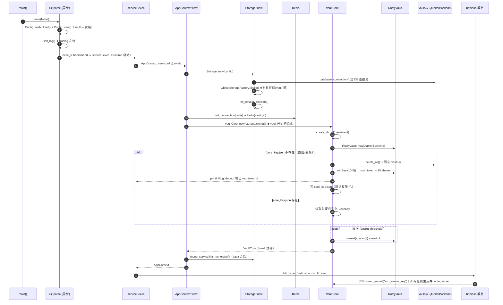

# Vault 模块现状与改进计划

本文档记录 `monoengine` 当前 `vault` 模块的实现形态、主要风险、与配置系统的依赖关系，以及后续分阶段改进计划。本文与 `docs/config.md` 中关于敏感配置、`SecretRef`、最小 DB/Vault bootstrap 和 `core_key.json` 加固的约束保持一致。

## 当前实现概览

`vault` 模块位于 `src/vault/`，核心集成代码在 `src/vault/integration/`：

- `src/vault/integration/vault_core.rs`：封装 `libvault_core::RustyVault`，提供 `VaultCore` 和 `VaultCoreInterface`。
- `src/vault/integration/jupiter_backend.rs`：将 RustyVault 的物理存储后端适配到 `jupiter` 数据库存储。
- `src/jupiter/storage/vault_storage.rs`：通过 SeaORM 读写 `vault` 表，提供 `list_keys`、`load`、`save`、`delete`、`delete_all`。
- `src/context/mod.rs`：在 `AppContext::new` 中构造 `Storage`、Redis 连接和 `VaultCore`。
- `src/server/ssh_server.rs`：通过 vault 保存或读取 `ssh_server_key`。
- `src/vault/pgp.rs`、`src/vault/nostr.rs`、`src/vault/pki.rs`：基于 `VaultCore` 扩展 PGP、Nostr、PKI 能力。

当前 vault 已经是可用的通用 KV secret store。`VaultCoreInterface` 提供：

- `read_secret(name)`：读取 `secret/<name>` 下的 KV 数据。
- `write_secret(name, data)`：写入 `secret/<name>`。
- `delete_secret(name)`：删除 `secret/<name>`。

因此，后续把可迁移凭据写入 vault 时，不需要重新发明 secret 存储能力。真正需要补齐的是安全加固、初始化语义、错误模型、最小 bootstrap、运维命令和配置侧的 `SecretRef` resolver。

## 启动依赖顺序

当前服务启动的关键顺序如下：

```text
Config::new
  -> Storage::new(config)          # 建数据库连接、构造对象存储、初始化部分存储能力
  -> init_connection(redis)        # 连接 Redis
  -> VaultCore::new(storage)       # vault 此时才就绪
  -> HTTP / SSH / 后台任务继续初始化
```

该顺序形成硬约束：

- `database.db_url` / 数据库密码属于引导配置，不能进入本项目 vault。
- `redis.url` 当前在 vault 前被消费，暂时不能进入本项目 vault。
- `object_storage.s3.access_key_id` / `secret_access_key` 当前在 `Storage::new` 中、vault 前被消费，暂时不能进入本项目 vault。
- `mail.password` 的消费晚于 vault 就绪，是第一批较合理的可迁移凭据。
- `config secret set/check`、`config validate --resolve-secrets` 不能复用完整 `AppContext`，必须使用最小 DB/Vault bootstrap。

任何试图在 `Config::new` 中读取 vault secret 的方案都不可行，因为 `Config::new` 是同步加载阶段，且此时 vault 还没有就绪。

## Vault 初始化时序（按代码核实）

本节是上面“启动依赖顺序”的代码级展开，所有步骤都标注了文件与行号，供实现与评审核对。启动分为两个阶段：**同步阶段**（尚未创建 tokio runtime，vault 不可能就绪）与**异步阶段**（`service::exec` 的 `#[tokio::main]` 启动 runtime 之后）。

### 进程入口到 vault 就绪

```text
【同步阶段 · 无 runtime】
main()                                          src/main.rs:34
└─ cli::parse(None)                             src/cli.rs:21
   ├─ ConfigLoader::new(input).load()           src/cli.rs:35   解析配置路径
   ├─ Config::new(path)                         src/cli.rs:37   同步加载 TOML（vault 未就绪）
   ├─ init_log(&config.log)                     src/cli.rs:44   ★ 安装 tracing subscriber（早于 vault）
   ├─ ctrlc::set_handler                         src/cli.rs:52
   └─ exec_subcommand(config, "service", ..)    src/cli.rs:65 → builtin_exec → service::exec

【异步阶段 · #[tokio::main] 启动 runtime】       src/commands/service/mod.rs:24
service::exec(config, args)
└─ AppContext::new(config).await               src/context/mod.rs:24
   ├─ Storage::new(config)                      src/context/mod.rs:27
   │   ├─ database_connection(&database)        src/jupiter/storage/mod.rs:160  建 DB 连接池
   │   ├─ ObjectStorageFactory::build(..)       src/jupiter/storage/mod.rs:175  ★ 对象存储（vault 前）
   │   └─ init_default_sidebars(&sidebar)       src/jupiter/storage/mod.rs:189
   ├─ init_connection(&config.redis)            src/context/mod.rs:30           ★ Redis（vault 前）
   ├─ VaultCore::new(storage.clone())           src/context/mod.rs:33   ◀── vault 在此初始化
   └─ mono_service.init_monorepo(&monorepo)     src/context/mod.rs:36           （vault 之后）
└─ 分发 http::exec / ssh::exec / multi::exec    src/commands/service/mod.rs:34-36
      └─（SSH 路径）读/生成 ssh_server_key       src/server/ssh_server.rs:78     ← 首个 vault 消费者
```

### Vault 内部时序（`VaultCore::new` → `config`）

```text
VaultCore::new(storage)                          src/vault/integration/vault_core.rs:52
├─ dir = mega_base()/vault ; create_dir_all      :53,56   （expect；无权限收紧）
└─ VaultCore::config(storage, key_path)          :60
   ├─ backend = JupiterBackend::new(storage)      :61   （RustyVault 物理后端 = DB 的 vault 表）
   ├─ SealConfig { secret_shares:10, secret_threshold:5 }  :62
   ├─ RustyVault::new(backend, None)              :67   （expect）
   ├─ if !key_path.exists():                      :70   ── 分支 A：首启 / key 缺失
   │    ├─ println!("clearing database…")         :71
   │    ├─ vault_storage.delete_all()             :74   ⚠ 清空 vault 表（数据丢失路径）
   │    ├─ rvault.init(&seal_config)              :79   → root_token + 10 个 shares
   │    ├─ println!("root token: {}", …)          :83   ⚠ root token 进 stdout
   │    └─ File::create(core_key.json) + 写入      :98   ⚠ 默认 umask 权限
   │  else:                                       :102  ── 分支 B：key 存在
   │    └─ read + 反序列化 CoreKey{shares,token}  :104
   ├─ for i in 0..5 { rvault.unseal(shares[i]) }  :108  解封（assert! ok）
   ├─ log::debug!("root token: {}", …)            :114  ⚠ root token 进 tracing（debug 级）
   └─ return VaultCore{ rvault, key }             :122  ◀── vault 就绪
```

### 时序图



### 时序中的关键事实

- vault 就绪点是唯一的 `VaultCore::new`（`context/mod.rs:33`）；在它之前已消费 DB、对象存储（`Storage::new` 内 `:175`）、Redis（`:30`）——这正是“启动依赖顺序”把这三类判为引导 / 早期运行时依赖、不能直接改 `SecretRef` 的代码依据。
- `mail.password` 的消费点（HTTP 服务启动后构造 SMTP mailer）晚于 vault，是第一批可迁移凭据。
- `init_monorepo` 在 vault 之后、服务启动之前执行（`context/mod.rs:36`），简化版顺序图省略了这一步。
- tracing subscriber 在 `cli.rs:44` 就已安装，早于 vault；因此 `VaultCore::config` 的 `println!`（:71/:83/:93/:103）与 `log::debug!(root_token)`（:114）会真的把 root token / 分片写进 stdout 与日志（详见“当前主要问题 · root token 明文输出”）。
- 分支 A 的 `delete_all()`（:74）仅凭 `core_key.json` 不存在即触发，无法区分“全新空库首启”与“误删 key 但库内有数据”（详见“fail-closed 判定依据必须区分首次初始化与误删 key”）。

## 威胁模型与安全边界

本计划的所有加固动作都应服务于一个明确的威胁模型；缺少威胁模型时，“是否符合 Vault 安全标准”无法被验证。

资产：

- vault 加密主密钥与 unseal 分片（`core_key.json` 中的 `secret_shares`）。
- vault root token。
- vault 内业务 secret（SSH host key、PGP / Nostr / PKI 私钥，以及未来迁移的 `mail.password` 等）。

假定的攻击者与防护目标：

- 仓库与代码评审泄露：secret 不得进入 git、TOML、镜像层。可防护。
- 日志与可观测性泄露：root token、分片、secret 明文不得进入 stdout / stderr / tracing / 错误信息。可防护（阶段 A）。
- 应用层误用：调用方不应接触 root token，也不应自由拼 raw path。可防护（阶段 C）。
- 进程内存读取：同一进程内 secret 必然以明文存在，不在本计划防护范围。
- 可读取部署机磁盘的攻击者：当前自动解封把分片与 root token 落盘，磁盘读取即等于完全攻陷 vault。**当前实现不防护此攻击**，只能通过外部 KMS / transit 自动解封或 systemd / K8s 注入降低，属阶段 J 与部署侧职责。

残余风险（必须在文档与运维说明中显式声明）：

- 自动解封模式下，`secret_shares: 10 / secret_threshold: 5` 的 Shamir 分片不提供职责分离收益——全部 10 份分片与 root token 同处一个 `core_key.json`，并在启动时自动用其中 5 份解封。分片在当前形态下是“安全装饰”；真正的职责分离需要把 key material 交给外部 KMS / transit seal，或多人托管分片（与无人值守启动互斥）。
- 因此安全收益的准确表述是“不进仓库、不进普通配置、不进日志、不被普通应用调用方接触”，而**不是**“可抵御获得磁盘读权限的攻击者”。

本期对齐的 Vault 标准子集：fail-closed seal、最小权限与 root token 生命周期、secret 访问审计、轮换 / rekey、脱敏、备份恢复。明确不在本期范围（如需可另立计划）：动态 secret 与租约 TTL、transit 加密即服务、response wrapping、HSM 集成。

## 当前主要问题

### `core_key.json` 缺失会清空 vault

`src/vault/integration/vault_core.rs` 当前在 key 文件不存在时会：

1. 打印清库重建提示。
2. 调用 `vault_storage.delete_all()` 清空 vault 表。
3. 重新初始化 RustyVault。
4. 生成新的 root token 和 secret shares。
5. 写入新的 `core_key.json`。

这意味着 `core_key.json` 丢失会导致所有 vault secret 被删除。集中更多凭据后，这会变成灾难性数据丢失路径。普通启动和 `config secret check` 必须改为 fail-closed：key 缺失时启动失败并提示恢复或显式 reset，不能自动清库。

当前测试 `test_vault_reinitialize_after_file_loss` 还固化了这一危险行为，后续需要改为验证 fail-closed。

### root token 明文输出

`VaultCore::config` 当前会通过 stdout 和 debug log 输出 root token。这违反 secret 迁移前的基本安全前提。迁移 `SecretRef` 前必须保证：

- root token 不进入 stdout。
- root token 不进入 stderr。
- root token 不进入 tracing 日志。
- secret shares 和完整 `core_key.json` 内容也不得输出。

否则，`SecretRef` 只能避免凭据进入 TOML，不能避免凭据进入日志。

### `core_key.json` 权限未显式收紧

当前 `core_key.json` 使用 `std::fs::File::create` 创建，依赖系统默认 umask。生产前需要显式加固：

- Unix 下 vault 目录权限应为 `0700` 或等价限制。
- Unix 下 `core_key.json` 权限应为 `0600`。
- 容器镜像、备份、日志采集必须排除该文件。
- 生产部署应优先考虑 systemd credential、Kubernetes Secret volume 或外部 secret manager 注入 key material，而不是长期保存普通明文文件。

即便完成权限加固，当前自动解封模式仍不能抵御能读取部署机磁盘的攻击者。安全收益应限定为“不进仓库、不进普通配置、不进日志”。

### 初始化路径大量 panic

`VaultCore::new` / `VaultCore::config` 当前返回 `Self`，内部使用大量 `expect`、`unwrap`、`assert`。这让调用方无法区分：

- vault 目录创建失败。
- key 文件不存在。
- key 文件不可读。
- key 文件格式错误。
- RustyVault 创建失败。
- init 失败。
- unseal 失败。
- 数据库存储失败。

后续应改为返回 `Result<Self, MegaError>`，或引入 `VaultError` 后统一转换为 `MegaError`。普通服务启动、`config secret check`、`config validate --resolve-secrets` 都需要可诊断错误，而不是 panic。

### `JupiterBackend` 依赖完整 `Storage`

`JupiterBackend` 当前接收完整 `Storage`，但实际只使用 `ctx.vault_storage()`。这让 vault bootstrap 被完整 `Storage::new` 绑定，而 `Storage::new` 会提前构造对象存储等能力。

这条 seam 太粗，直接阻碍 `config secret set/check` 独立运行。目标是拆出最小 DB/Vault bootstrap，只建立数据库连接和 `VaultStorage` 所需能力，不初始化 Redis、对象存储、HTTP、SSH、monorepo 或后台任务。

### `VaultCoreInterface` 暴露过多底层细节

当前 interface 包含 `token()`、`read_api`、`write_api`、`delete_api`、`read_secret`、`write_secret`、`delete_secret`。普通调用方不应该知道 root token，也不应该直接拼 RustyVault API path。

后续应分层：

- vault 内部保留 raw API 能力。
- 业务调用方只使用规范化 secret name。
- 配置系统通过 `SecretResolver` 使用 `SecretRef`，不直接依赖 raw vault path。

### secret path 语义容易误用

`write_secret(name)` 内部会访问 `secret/{name}`。如果调用方传入 `secret/config/prod/mail/password`，最终会访问 `secret/secret/config/prod/mail/password`。

因此运维命令和 resolver 必须明确区分：

- VaultCore 的相对 secret name：`config/prod/mail/password`。
- 配置文件里的引用：`vault://secret/config/prod/mail/password#value`。
- RustyVault 内部 path：`secret/config/prod/mail/password`。

resolver 不能把完整 URI 直接传给 `read_secret`。

### 消费端假设 vault 数据永远正确

当前 SSH、PGP、Nostr 等调用点大量使用 `unwrap()` 和 `expect()`，并假设 secret JSON shape 永远正确。例如：

- `src/server/ssh_server.rs` 读取 `ssh_server_key.secret_key`。
- `src/vault/pgp.rs` 读取 `pgp-signed-secret.pub_key` / `sec_key`。
- `src/vault/nostr.rs` 读取 `nostr_identity_key.nostr` / `secret_key`。

当 vault 数据损坏、字段缺失或格式错误时，服务会 panic。迁移配置 secret 前，需要逐步把这些路径改为返回可诊断错误。

### root token 永久留存，且应用全程以 root 身份操作

`core_key.json` 永久保存 root token，`VaultCoreInterface` 的所有读写都用 `self.token()`（即 root token）直连 RustyVault。这违反 Vault 的最小权限与 root token 生命周期标准：root token 应仅用于初始化，之后撤销，日常操作通过按 policy 限权的非 root token 完成，需要时再用 generate-root 临时重建。

仅“不输出 root token”无法解决这一点：只要 root token 长期存在并用于每次操作，一旦泄露即等于完全攻陷。阶段 C 收窄的是 Rust 调用面，并非 vault 层授权——底层仍是 root。真正的最小权限需要在 vault 内定义 policy，并为 SSH、PGP、Nostr、PKI、config 等消费端签发各自的限权 token（见阶段 I）。

### 缺少 secret 访问审计

当前没有任何 secret 访问审计。集中托管凭据的系统若无法回答“谁、在何时、访问了哪个 secret、结果如何”，不满足 Vault 生产加固的基本要求。需要启用审计设备（或在 interface 上统一审计 hook），记录每次 secret 读写的元数据，并对 secret 值做哈希 / 省略；审计日志本身不得泄露明文、root token 或分片（见阶段 H）。

### 缺少轮换、rekey 与备份恢复方案

计划目前只有破坏性 re-init，缺少三类标准能力：

- vault 加密 key 轮换（`sys/rotate` 等价能力）。
- unseal 分片 rekey：`core_key.json` 疑似泄露后，在不丢数据的前提下重新生成分片与 root token。
- 业务 secret 轮换（例如周期性更换 `mail.password`）。

更关键的是，阶段 A 把 key 缺失改为 fail-closed 是正确的，但 fail-closed 的另一面是“缺少恢复路径就等于 key 丢失即永久数据丢失”。文档要求把 `core_key.json` 排除出镜像 / 日志 / 备份，却没有定义 key material 的安全托管位置与恢复流程。必须明确：分片 / root token 的安全备份位置（外部 secret manager、离线托管等）、恢复步骤，以及“DB 数据尚在但 key 丢失”时的 rekey / 恢复预案（见阶段 J）。这与 `docs/config.md` 中“Vault 加固是 SecretRef 生产化迁移硬前置”的约束一致。

### fail-closed 判定依据必须区分首次初始化与误删 key

仅以“`core_key.json` 是否存在”做判定会引入新缺陷：全新部署本来就没有 key 文件，若一律 fail-closed，则在阶段 D 的 CLI 初始化命令落地前，全新环境将**无法完成首次初始化**。

正确判定依据是 vault 在 DB 中是否已初始化（`rvault.core.load().inited()`，测试已使用该接口），而非 key 文件是否存在：

- DB 未初始化 + key 文件缺失 → 合法首次初始化，允许 init 并写入新 key 文件。
- DB 已初始化 + key 文件缺失 → 危险（数据在、解封材料丢失）→ fail-closed，提示恢复或显式 reset，**绝不** `delete_all()`。

### `core_key.json` 与 `vault` 表缺少格式 / 兼容迁移

一旦阶段 A / I 改变 key 文件语义（例如不再长期保存 root token、或新增字段），已有部署的旧 `core_key.json` 需要兼容或迁移路径，否则升级即触发 fail-closed。计划需要为 key 文件和 `vault` 表的格式演进定义版本字段与迁移策略。

## 字段迁移分类

| 字段 | 当前消费点 | 分类 | 迁移结论 |
| --- | --- | --- | --- |
| `database.db_url` / 数据库密码 | `Storage::new` 建库连接 | 引导配置 | 不能进本项目 vault；通过 TOML/env/部署平台 secret 提供 |
| `redis.url` | `AppContext::new` 中 vault 前连接 Redis | 早期运行时依赖 | 暂时不能进本项目 vault；若含密码应走部署平台 secret 并脱敏日志 |
| `object_storage.s3.*` | `Storage::new` 中 vault 前构造对象存储 | 早期运行时依赖 | 暂时不能进本项目 vault；需先重构初始化顺序 |
| `orion_server.db_url` | Orion 相关配置 | 引导或独立服务配置 | 不默认纳入 monoengine vault；按 Orion 启动依赖单独判断 |
| `mail.password` | HTTP 服务启动后构造 SMTP mailer | 可迁移凭据 | 第一批可改为 `SecretRef` |
| `ssh_server_key` | SSH server 启动时读取或生成 | vault 内部 secret | 已由 vault 管理，但需要加固错误处理和 key 文件安全 |
| PGP / Nostr key | `vault/pgp.rs`、`vault/nostr.rs` | vault 内部 secret | 已由 vault 管理，但需要清理 panic 与数据 shape 校验 |

## 改进原则

1. 先加固 vault，再迁移配置 secret。
2. `Config::new` 只解析 `SecretRef`，不读取真实 secret。
3. secret 真实值解析必须发生在 vault 就绪之后。
4. `config secret set/check` 必须使用最小 DB/Vault bootstrap。
5. 引导配置和早期运行时依赖不进入本项目 vault。
6. root token、secret shares、明文 secret、数据库 URL 密码、Redis URL 密码都不得进入日志或错误信息。
7. 破坏性 reset 必须是显式运维动作，不能隐藏在普通启动中。
8. fail-closed 必须与备份恢复方案配套；引入 fail-closed 前后，key 丢失（数据在）必须有文档化的恢复或安全重置路径。
9. 最小权限优先：root token 仅用于初始化，常规运行通过限权 token；调用方不接触 root token，也不直接拼 raw path。
10. secret 访问可审计：read/write/delete 留下不含明文的审计记录。
11. 每个阶段都应独立可编译、可测试、可回滚。

## 分阶段计划

### 阶段 A：Vault 安全止血

目标：在迁移任何配置 secret 前，消除最危险的泄露和数据丢失路径。

工作项：

1. 删除 root token 的 stdout、stderr、tracing 输出。
2. 删除 secret shares 和完整 key 文件内容的任何输出。
3. `VaultCore::new` / `VaultCore::config` 改为返回 `Result<Self, _>`，引入专门的 `VaultError`（区分目录创建、key 缺失、key 不可读、格式错误、init、unseal、存储失败），并统一转换为 `MegaError`。`VaultError` 与其 `Display` 不得嵌入 root token、分片或 secret 明文；不要用 `MegaError::Other(format!(..))` 直接拼接敏感值。
4. 替换初始化路径上的 `expect`、`unwrap`、`assert`。
5. fail-closed 判定以 DB 是否已初始化（`rvault…inited()`）为准，而非 key 文件是否存在：DB 已初始化但 key 文件缺失时启动失败、**绝不** `delete_all()`；仅当 DB 未初始化且无 key 文件时才允许合法首次初始化。
6. 显式 reset/init 作为后续运维命令设计，不能由普通启动隐式触发。
7. Unix 下创建 vault 目录时设置 `0700`，创建 `core_key.json` 时设置 `0600`。
8. 将 `test_vault_reinitialize_after_file_loss` 改为验证 key 缺失不会清空 vault 数据。

验收标准：

- 启动和测试日志中不出现 root token（应有捕获日志的测试断言 token 与分片不出现）。
- 全新（空 DB）环境仍可完成首次初始化；DB 已初始化但删除 `core_key.json` 后，普通启动失败且 vault 表数据不被清空。
- 初始化失败返回可诊断错误，不 panic，且错误信息不含 token / 分片 / 明文。
- key 文件和目录权限符合最小可读写范围。

### 阶段 B：拆出最小 DB/Vault bootstrap seam

目标：让 vault 运维命令不依赖完整 `AppContext`。

工作项：

1. 将 `JupiterBackend` 从依赖完整 `Storage` 改为依赖最小 vault storage seam。
2. 新增 `VaultBackendStorage` 或等价接口，只覆盖 `list_keys`、`load`、`save`、`delete`。
3. 让 `VaultStorage` 成为生产 adapter。
4. 新增 DB-only / Vault-only bootstrap 能力，只建立数据库连接和 `VaultStorage`。
5. 确保该 bootstrap 不初始化 Redis、对象存储、HTTP、SSH、monorepo、后台任务。

验收标准：

- 可以只凭数据库配置构造 `VaultCore`。
- `config validate --resolve-secrets` 的底层 bootstrap 不依赖 Redis/S3。
- vault 集成测试不需要完整服务上下文。

### 阶段 C：收窄 Vault interface

目标：隐藏 token、raw API path 和路径拼接规则，减少调用方误用。

工作项：

1. 将 raw `read_api` / `write_api` / `delete_api` 限制在 vault 内部。
2. 普通业务调用方只使用相对 secret name。
3. 引入 `SecretName` 或等价校验，禁止以 `/` 开头，禁止带 `secret/` 前缀。
4. 错误信息只输出 redacted path，不输出 secret 明文。
5. 逐步让 SSH、PGP、Nostr、PKI 调用点使用收窄后的 interface。

验收标准：

- 普通调用方无法访问 root token。
- `secret/secret/...` 这类路径重复可以在入口被拒绝。
- 错误信息不包含明文 secret。

### 阶段 D：CLI LoadMode 与 vault 运维命令基础

目标：为 `config secret` 命令提供正确启动模型。

工作项：

1. 先在 CLI 层支持两阶段加载和 `LoadMode`。
2. 新增不依赖 vault 的 `monoengine config secret ref`。
3. 基于最小 DB/Vault bootstrap 新增 `config secret set`。
4. 基于最小 DB/Vault bootstrap 新增 `config secret check`。
5. 新增 `config validate --resolve-secrets`。

命令规则：

- `secret ref` 只生成引用，不连接数据库，不初始化 vault。
- `secret set/check` 只连接数据库和 vault，不构造完整 `AppContext`。
- `secret set` 默认只接受 `--value-stdin` 或隐藏输入。
- `secret set` 默认不修改 TOML，只输出 `vault://secret/...#field`。
- 不允许通过这些命令写入数据库密码、Redis URL、当前阶段对象存储 key。

验收标准：

- 坏配置时 `config validate` 能输出诊断，而不是被 CLI 预加载拦截。
- 缺 Redis/S3 时仍可执行需要 vault 的 secret 检查，只要数据库和 vault key 可用。
- secret 明文不进入 shell 参数、日志或错误信息。

### 阶段 E：SecretRef 与第一批配置凭据迁移

目标：让配置文件保存 secret 引用，而不是保存可迁移凭据明文。

首批字段：

- `mail.password` -> `mail.password_ref`

工作项：

1. 在配置模块中定义 `SecretRef`。
2. 定义 `SecretResolver` trait。
3. 实现 `VaultSecretResolver` adapter，内部调用 `VaultCoreInterface::read_secret`。
4. resolver 将 `vault://secret/config/prod/mail/password#value` 映射为 `read_secret("config/prod/mail/password")`，再读取 `value` 字段。
5. `mail.password` 和 `mail.password_ref` 迁移期互斥：同时存在为 hard error。
6. 消费端在 vault 就绪后通过 resolver 获取 SMTP 密码。
7. resolver 提供缓存 TTL 和 `evict` / `evict_all`。

验收标准：

- `mail.password_ref` 可解析并用于 SMTP mailer。
- secret 缺失、字段缺失、引用格式错误均返回可诊断错误。
- 错误和日志只出现脱敏引用，不出现明文密码。
- `database`、`redis`、`object_storage.s3.*` 没有被错误迁移为 `SecretRef`。

### 阶段 F：清理现有 vault 消费端 panic

目标：让 vault 内部 secret 数据损坏时可诊断、可恢复，而不是直接 crash。

优先处理：

1. `src/server/ssh_server.rs`：SSH server key 读取、生成、写入失败返回错误。
2. `src/vault/pgp.rs`：PGP key 读取、解析、保存、删除返回 `Result`。
3. `src/vault/nostr.rs`：Nostr key 读取、生成、解析返回 `Result`。
4. `src/vault/pki.rs`：PKI API 统一错误模型，避免新增 panic 风格路径。

验收标准：

- vault secret JSON 缺字段时不会 panic。
- secret 内容格式错误时返回包含 secret name 和字段路径的错误。
- 错误信息不包含 secret 明文。

### 阶段 G：对象存储等早期依赖后置初始化（可选）

目标：只有在确实需要让对象存储凭据进入 vault 时，才重构完整初始化顺序。

目标链路：

```text
Config::new
  -> DbStorage::new(database 引导配置)
  -> VaultCore::new(db_storage)
  -> SecretResolver::new(vault)
  -> resolve object storage secrets
  -> Full Storage / server / task 初始化
```

验收标准：

- S3/S3-compatible 凭据迁移前，服务启动链路不再在 vault 前构造对象存储。
- 缺少对象存储 secret 时返回可诊断错误。
- `config secret set/check` 对其他 secret 的操作不依赖对象存储可用。

### 阶段 H：Secret 访问审计

目标：让 vault secret 的访问可追溯，满足集中凭据托管的审计要求。

工作项：

1. 启用 vault 审计设备，或在收窄后的 `VaultCoreInterface` 上增加统一审计 hook。
2. 记录每次 read / write / delete 的调用方、规范化 secret name、时间、结果（成功 / 失败 / 未命中）。
3. 审计记录对 secret 值做哈希或省略，绝不落明文；root token、分片不进入审计。
4. 显式决定并记录审计写入失败的策略（fail-open 还是 fail-closed）。

验收标准：

- 每次 secret 访问产生一条不含明文的审计记录。
- 审计记录包含足以定位调用方与 secret name 的字段。
- 审计目的地可配置，默认开启。

### 阶段 I：root token 退役与最小权限 policy

目标：从“全程 root”过渡到按 policy 限权，符合 Vault root token 生命周期标准。

工作项：

1. 在 vault 内按 secret 前缀定义 policy（如 ssh、pgp、nostr、pki、`config/*` 各自最小权限）。
2. 为各消费端签发限权 token，替换直接使用 root token 的路径。
3. 初始化后撤销常驻 root token，需要时通过 generate-root 临时重建。
4. `core_key.json` 不再长期保存可用 root token，仅保留恢复所需的分片（与阶段 J 的备份方案配合）。

验收标准：

- 常规运行链路不持有可用 root token。
- 任一消费端 token 泄露只影响其 policy 覆盖的 secret。
- 仍可通过显式运维流程重建 root 权限执行管理操作。

### 阶段 J：轮换、rekey 与备份恢复

目标：让泄露和 key 丢失可恢复，而非只能清库重建；为 fail-closed 配齐恢复路径。

工作项：

1. 提供 vault 加密 key 轮换与 unseal 分片 rekey 的运维命令。
2. 定义 key material（分片 / 恢复凭据）的安全托管与备份位置（外部 secret manager / 离线托管），写入运维 runbook。
3. 定义“DB 数据在、key 丢失”的恢复流程，以及疑似 `core_key.json` 泄露后的 rekey 流程。
4. 为可迁移 secret（首批 `mail.password`）提供轮换支持。
5.（可选，长期）评估外部 KMS / transit auto-unseal，替代本地落盘自动解封，缓解磁盘读取威胁。

验收标准：

- 分片 rekey 后旧 `core_key.json` 失效，数据不丢。
- 文档化的恢复 runbook 可在 key 丢失（数据在）场景下恢复访问或安全重置。
- secret 轮换不需要重启全部依赖该 secret 的服务，或明确其重启要求。

## 推荐优先级

| 优先级 | 工作 | 原因 |
| --- | --- | --- |
| P0 | 删除 root token 输出、初始化返回 `Result` / `VaultError`（不泄敏） | 迁移任何 secret 前的安全前置 |
| P0 | 以“DB 是否已初始化”为准的 fail-closed，替换清库重建的行为和测试 | 旧行为会灾难性丢数据；纯文件判定又会误伤全新部署 |
| P1 | 拆出最小 DB/Vault bootstrap seam | `config secret set/check` 的必要条件 |
| P1 | 收窄 vault interface，隐藏 token 和 raw path | 降低误用和泄露风险 |
| P1 | Secret 访问审计（阶段 H） | 集中凭据托管的审计基线 |
| P1 | key 丢失 / 泄露的备份恢复 runbook（阶段 J 第 2–3 项） | fail-closed 必须配套恢复路径，否则 key 丢失即永久数据丢失 |
| P2 | `config secret ref/set/check` | 形成标准运维入口 |
| P2 | `SecretRef` + resolver + `mail.password_ref` | 第一批可迁移凭据 |
| P2 | root token 退役与最小权限 policy（阶段 I） | 避免“全程 root”，符合 root token 生命周期 |
| P3 | 清理 SSH/PGP/Nostr panic | 提升 vault 数据损坏时的可恢复性 |
| P3 | key / 分片 rekey 与 secret 轮换（阶段 J 第 1、4 项） | 泄露后可恢复，不必清库重建 |
| P4 | 对象存储后置初始化 | 只有 S3 凭据要进 vault 时才需要 |
| P4 | 外部 KMS / transit auto-unseal | 缓解磁盘读取威胁，需部署侧支持 |

## 架构 deepening 机会

### 将 VaultCore deepening 为 secret store module

涉及文件：

- `src/vault/integration/vault_core.rs`
- `src/vault/pgp.rs`
- `src/vault/nostr.rs`
- `src/server/ssh_server.rs`

问题：调用方需要知道 token、path、JSON shape、字段名和错误行为，interface 过宽且接近 implementation。

方案：让 `VaultCore` 对外只提供规范化 secret 操作，业务模块通过 typed helper 读取自己的 secret。path 映射、redaction、错误分类集中在 vault module 内部。

收益：调用方 interface 更小，测试 surface 更清晰，secret shape 变更的 locality 更好。

### 将 JupiterBackend 改为最小 storage seam

涉及文件：

- `src/vault/integration/jupiter_backend.rs`
- `src/jupiter/storage/vault_storage.rs`
- `src/context/mod.rs`

问题：vault 只需要 vault table，却依赖完整 `Storage` 生命周期。

方案：引入最小 `VaultBackendStorage` seam，让 `VaultStorage` 成为 adapter。`JupiterBackend` 不再知道完整 `Storage`。

收益：`config secret` 命令不被 Redis、S3、monorepo 初始化阻塞；vault 测试更容易隔离。

### 将 SecretRef resolver 放在配置 module

涉及文件：

- 未来 `src/config/secret.rs`
- `src/vault/integration/vault_core.rs`

问题：`VaultCore` 管 secret 存储，`SecretRef` 管配置引用，两者语义不同。

方案：在 config module 定义 `SecretRef` 和 `SecretResolver`，由 `VaultSecretResolver` 作为 adapter 连接 vault。

收益：`Config::new` 继续只做同步配置解析，secret 解析作为 vault 就绪后的独立异步阶段，符合启动依赖顺序。

### vault 运维命令使用 LoadMode

涉及文件：

- `src/cli.rs`
- `src/commands/mod.rs`
- 未来 `src/commands/config.rs`

问题：当前 CLI 在分发任何子命令前会加载完整配置，完整 `AppContext` 又会初始化过多依赖。

方案：先实现两阶段 CLI 和 `LoadMode`，再让 `config secret` 选择 `VaultBootstrap`，让 `service` 选择 `FullAppContext`。

收益：无配置、坏配置、缺 Redis/S3 时仍能执行配置诊断和 secret 运维。

## 下一步建议

第一批 PR 应只做 P0，范围控制在 vault 安全止血：

1. `VaultCore::new` / `VaultCore::config` 改为返回 `Result`，引入不泄敏的 `VaultError`。
2. 删除 root token、分片、key 文件内容的所有输出（stdout / stderr / tracing）。
3. fail-closed 以 `rvault…inited()` 为准：DB 已初始化但 key 缺失即失败、不清库；空 DB 无 key 仍可合法首次初始化。
4. key 文件和目录创建时设置权限（目录 `0700`、`core_key.json` `0600`）。
5. 把 `test_vault_reinitialize_after_file_loss` 改为：DB 已初始化时缺 key 不清空数据，并新增空 DB 首次初始化用例。
6. 更新调用方（至少 `AppContext::new`、`ssh_server.rs`），让启动失败返回可诊断错误。

这一步完成前，不建议开始 `SecretRef`、`mail.password_ref` 或对象存储凭据迁移。备份恢复 runbook（P1）应与 fail-closed 同期或紧随其后落地——否则 fail-closed 会把“key 丢失”从“自动重建”变成“无法恢复”。审计（阶段 H）与 root token 退役（阶段 I）应在迁移更多生产凭据前完成，以满足 Vault 安全标准。
